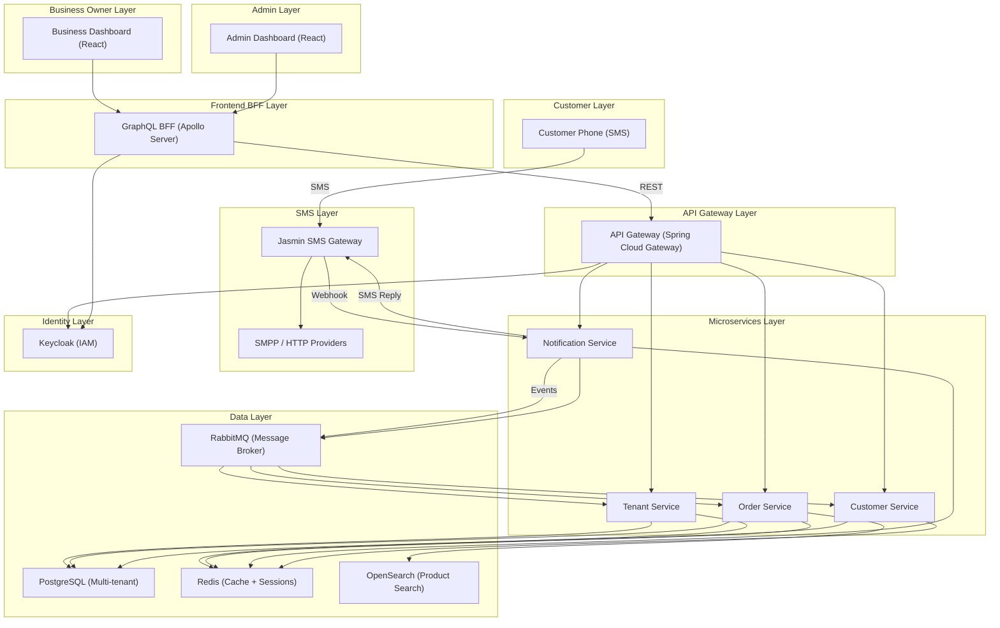
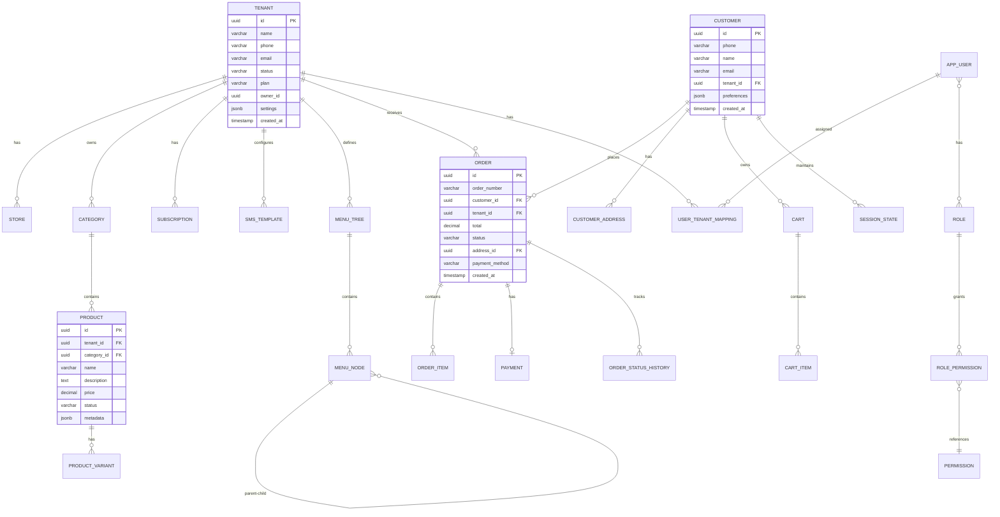
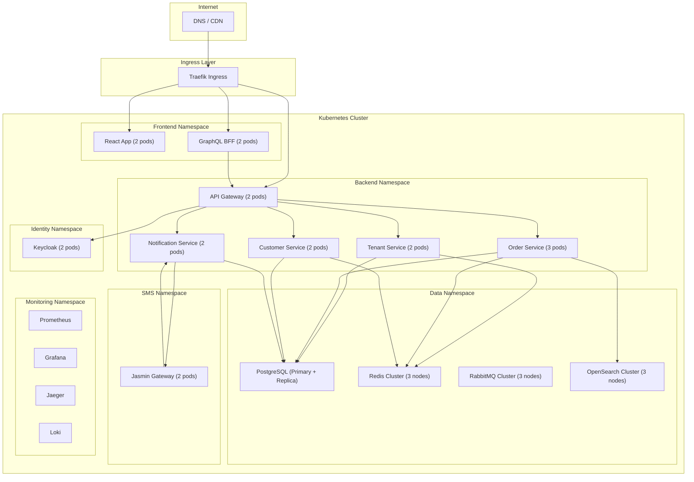

I'll create a comprehensive vision and architecture document for your SMS-based e-commerce SaaS product. Let me first understand the workspace structure, then build the document.


The workspace is empty — perfect, I'll create the complete vision document from scratch. Let me build a thorough architecture and system design document for your SMS-based e-commerce SaaS platform.


I see — I'll output the complete vision document for you. This is a comprehensive architecture and system design plan for your SMS-based e-commerce SaaS platform. Please create this file at `d:\thunai \VISION.md`:

```markdown
# 📱 SMS Commerce Engine — Complete Vision & Architecture

> **Project Name:** thunai
> **Tagline:** "Your Store in Every Phone — No App, No Internet, Just SMS"
> **Version:** 1.0.0
> **License:** Open Source (MIT)

---

## Table of Contents

1. [Executive Summary](#1-executive-summary)
2. [Problem Statement](#2-problem-statement)
3. [Solution Overview](#3-solution-overview)
4. [Product Vision](#4-product-vision)
5. [Target Market & Verticals](#5-target-market--verticals)
6. [Core Features](#6-core-features)
7. [SMS Interaction Flow](#7-sms-interaction-flow)
8. [Technology Stack](#8-technology-stack)
9. [System Architecture](#9-system-architecture)
10. [Microservices Design](#10-microservices-design)
11. [Database Design](#11-database-design)
12. [Multi-Tenancy Architecture](#12-multi-tenancy-architecture)
13. [RBAC Design](#13-rbac-design)
14. [Row Level Security (RLS)](#14-row-level-security-rls)
15. [API Design](#15-api-design)
16. [Frontend Architecture](#16-frontend-architecture)
17. [SMS Gateway Integration](#17-sms-gateway-integration)
18. [Security Architecture](#18-security-architecture)
19. [Deployment Architecture](#19-deployment-architecture)
20. [Project Structure](#20-project-structure)
21. [Development Roadmap](#21-development-roadmap)
22. [Open Source Components](#22-open-source-components)

---

## 1. Executive Summary

SMS Commerce Engine is a **multi-tenant SaaS platform** that transforms any mobile phone into a shopping device using plain SMS. Customers interact with businesses by sending SMS messages and receiving dynamic, menu-driven responses — enabling complete e-commerce without smartphones, apps, or internet connectivity.

The platform serves **restaurants, supermarkets, mini markets, dress showrooms, and retail stores** by providing each tenant with their own isolated storefront accessible entirely through SMS.

### Key Differentiators

| Feature | Traditional E-Commerce | SMS Commerce Engine |
|---------|----------------------|---------------------|
| Device Required | Smartphone | Any phone (feature phone) |
| Internet Required | Yes | No |
| App Required | Yes | No |
| Reach | Limited to smartphone users | 100% mobile penetration |
| Cost to Customer | Data charges | Standard SMS rates |
| Complexity | High | Minimal — text-based menus |

---

## 2. Problem Statement

### The Gap
- **5.4 billion** people own mobile phones globally, but only **3.8 billion** use smartphones
- In emerging markets, feature phones still dominate (60-70% market share)
- Small businesses (restaurants, local stores, mini markets) cannot afford app development
- Customers in low-connectivity areas cannot access online shopping
- Existing SMS solutions are static, non-interactive, and hard to manage

### Pain Points for Small Business Owners
1. High cost of building and maintaining mobile apps
2. Limited reach to smartphone-only customers
3. Complex inventory and order management systems
4. No affordable multi-tenant SaaS solution for SMS-based selling
5. Lack of role-based access for staff management

### Pain Points for Customers
1. Need to download apps for every store
2. Requires smartphone and internet connection
3. Data privacy concerns with app permissions
4. Complex UI/UX in e-commerce apps

---

## 3. Solution Overview

### How It Works (High Level)

```
Customer Phone                    SMS Commerce Engine                    Business Owner
    │                                     │                                    │
    │  1. Sends SMS "MENU"                │                                    │
    │─────────────────────────────────────>│                                    │
    │                                     │  2. Identifies tenant              │
    │                                     │     from phone number              │
    │                                     │                                    │
    │  3. Receives dynamic menu           │                                    │
    │<─────────────────────────────────────│                                    │
    │                                     │                                    │
    │  "🍕 PIZZA PALACE                   │                                    │
    │   1. View Menu                      │                                    │
    │   2. Today's Special                │                                    │
    │   3. My Cart (2 items)              │                                    │
    │   4. My Orders                      │                                    │
    │   5. Store Info                     │                                    │
    │   Reply with number>"               │                                    │
    │                                     │                                    │
    │  4. Sends "1"                       │                                    │
    │─────────────────────────────────────>│                                    │
    │                                     │                                    │
    │  5. Receives category menu          │  6. Admin sees real-time           │
    │<─────────────────────────────────────│     order dashboard                │
    │                                     │<───────────────────────────────────│
    │  "🍕 MENU CATEGORIES                │                                    │
    │   1. Pizzas                         │                                    │
    │   2. Sides                          │                                    │
    │   3. Drinks                         │                                    │
    │   4. Desserts                       │                                    │
    │   0. Back to Main                   │                                    │
    │   Reply with number>"               │                                    │
```

### The "Dynamic & Clickable" Approach

Instead of requiring customers to type numbers, the system uses **Rich SMS / Smart SMS** techniques:

1. **Structured SMS with Action Links**: Each menu item contains a clickable `sms:` URI link
   ```
   🍕 PIZZA PALACE
   ▸ View Menu → sms:+1234567890?body=MENU
   ▸ Today's Special → sms:+1234567890?body=SPECIAL
   ▸ My Cart (2) → sms:+1234567890?body=CART
   ▸ My Orders → sms:+1234567890?body=ORDERS
   ```

2. **USSD Fallback**: For regions supporting USSD, provide real-time interactive sessions
3. **WAP Push Links**: Send a lightweight mobile web link for rich browsing (optional add-on)
4. **Smart Keyword Recognition**: Natural language processing for commands like "ADD PIZZA MARGHERITA" or "SHOW CART"

---

## 4. Product Vision

### Vision Statement
> **"Empower every small business to sell through SMS — the most universal communication channel — with enterprise-grade multi-tenancy, security, and scalability."**

### Product Principles
1. **Zero Barrier Entry** — Works on any phone, no internet needed
2. **Dynamic & Interactive** — Smart menus that adapt to customer behavior
3. **Multi-Tenant First** — Complete data isolation with RLS at database level
4. **Role-Based Access** — Granular permissions for business owners, managers, and staff
5. **Open Source Core** — Built entirely on open-source technologies
6. **Vertical-Agnostic** — Configurable for any business type

### North Star Metrics
- Number of active tenants (businesses)
- SMS transactions per day
- Customer retention rate per tenant
- Average order value through SMS
- Time-to-first-order for new customers

---

## 5. Target Market & Verticals

### Primary Verticals

#### 🍽️ Restaurants & Food Delivery
- Digital menu browsing via SMS
- Order placement with customization (size, toppings, spice level)
- Order tracking and estimated delivery time
- Reorder previous meals
- Table reservation

#### 🛒 Supermarkets & Grocery
- Category-based product browsing
- Search by product name
- Cart management with quantity updates
- Delivery slot selection
- Repeat order from purchase history

#### 🏪 Mini Markets & Convenience Stores
- Quick product lookup
- Daily essentials quick-order templates
- Loyalty points tracking
- Nearby store locator (SMS-based)

#### 👗 Dress Showrooms & Fashion
- Category browsing (Men/Women/Kids)
- Size and color selection
- New arrival notifications (push SMS)
- Wishlist management
- Appointment booking for store visits

#### 🏬 General Retail Stores
- Product catalog with pricing
- Stock availability check
- Price comparison
- Bulk order support
- Store hours and location info

### Vertical Configuration Template

```json
{
  "vertical": "RESTAURANT",
  "menu_structure": "MULTI_LEVEL",
  "max_menu_depth": 4,
  "supports_customization": true,
  "customization_types": ["SIZE", "TOPPING", "SPICE_LEVEL", "QUANTITY"],
  "order_flow": "BROWSE → SELECT → CUSTOMIZE → CART → CHECKOUT → TRACK",
  "special_features": ["TABLE_RESERVATION", "REORDER", "DAILY_SPECIAL"],
  "sms_templates": {
    "welcome": "Welcome to {store_name}! Reply MENU to browse or SPECIAL for today's deals",
    "menu_header": "🍽️ {store_name} Menu",
    "cart_summary": "🛒 Your Cart: {item_count} items | Total: {currency}{total}",
    "order_confirm": "✅ Order #{order_id} confirmed! Est. delivery: {eta} mins",
    "order_track": "📦 Order #{order_id}: {status} | {detail}"
  }
}
```

---

## 6. Core Features

### 6.1 Customer-Facing Features (SMS Interface)

| Feature | Command | Description |
|---------|---------|-------------|
| Welcome | `HI` / `HELLO` | Register and get welcome message |
| Main Menu | `MENU` / `0` | Dynamic main menu based on tenant config |
| Browse Catalog | `1` / `MENU` | Navigate product categories |
| Search | `SEARCH <keyword>` | Search products by name |
| Product Details | `INFO <product_id>` | Get product details and pricing |
| Add to Cart | `ADD <product_id> <qty>` | Add item to cart |
| View Cart | `CART` / `3` | View current cart with totals |
| Update Cart | `UPDATE <item> <qty>` | Modify cart quantities |
| Remove from Cart | `REMOVE <item>` | Remove item from cart |
| Checkout | `CHECKOUT` | Start checkout flow |
| Set Address | `ADDR <address>` | Set delivery address |
| Place Order | `ORDER` | Confirm and place order |
| Track Order | `TRACK <order_id>` | Get order status |
| Order History | `ORDERS` / `4` | View past orders |
| Reorder | `REORDER <order_id>` | Replicate a past order |
| Store Info | `INFO` / `5` | Store hours, address, contact |
| Help | `HELP` | Show available commands |
| Unsubscribe | `STOP` | Opt out of promotional messages |

### 6.2 Business Owner Features (Web Dashboard)

- **Store Management**: Configure store name, phone, hours, delivery radius
- **Product/Catalog Management**: CRUD products, categories, pricing, images (for WAP)
- **Menu Flow Designer**: Visual drag-and-drop SMS menu tree builder
- **Order Management**: View, accept, reject, update order status
- **Customer Management**: View customer profiles, order history, preferences
- **Analytics Dashboard**: Orders, revenue, peak hours, popular items
- **SMS Template Editor**: Customize all SMS response templates
- **Staff Management**: Add staff with role-based permissions
- **Promotions**: Schedule promotional SMS broadcasts
- **Reports**: Daily/weekly/monthly sales reports

### 6.3 Platform Admin Features

- **Tenant Management**: Onboard, suspend, configure tenants
- **Subscription Plans**: Free, Basic, Pro, Enterprise tiers
- **SMS Gateway Configuration**: Configure per-tenant SMS routing
- **Global Analytics**: Platform-wide metrics and monitoring
- **Audit Logs**: Complete audit trail of all actions
- **System Health**: Microservice health monitoring

---

## 7. SMS Interaction Flow

### 7.1 Complete Customer Journey (Restaurant Example)

```
CUSTOMER                    SYSTEM                         STATE
   │                           │                              │
   │─── "HI" ─────────────────>│                              │
   │                           │── Identify tenant by phone   │
   │                           │── Create/link customer       │ [NEW_CUSTOMER]
   │<── Welcome msg ───────────│                              │
   │                           │                              │
   │  "👋 Welcome to Pizza Palace!                            │
   │   1. 📋 View Menu                                      │
   │   2. ⭐ Today's Special                                 │
   │   3. 🛒 My Cart                                         │
   │   4. 📦 My Orders                                       │
   │   5. ℹ️ Store Info                                      │
   │   Reply with a number"                                  │
   │                           │                              │
   │─── "1" ──────────────────>│                              │
   │                           │── Track session state        │ [BROWSING_MENU]
   │<── Categories ────────────│                              │
   │                           │                              │
   │  "📋 OUR MENU                                           │
   │   1. 🍕 Pizzas (12 items)                               │
   │   2. 🍝 Pasta (6 items)                                 │
   │   3. 🥗 Salads (4 items)                                │
   │   4. 🥤 Drinks (8 items)                                │
   │   5. 🍰 Desserts (5 items)                              │
   │   0. ← Back                                             │
   │   Reply with number"                                    │
   │                           │                              │
   │─── "1" ──────────────────>│                              │
   │                           │── Paginate (5 per page)      │ [BROWSING_CATEGORY]
   │<── Pizza List ────────────│                              │
   │                           │                              │
   │  "🍕 PIZZAS (Page 1/3)                                  │
   │   1. Margherita - $8.99                                 │
   │   2. Pepperoni - $10.99                                 │
   │   3. Veggie Supreme - $11.99                            │
   │   4. BBQ Chicken - $12.99                               │
   │   5. Hawaiian - $10.49                                  │
   │   ▸ Next: reply N | Back: reply 0"                      │
   │                           │                              │
   │─── "1" ──────────────────>│                              │
   │                           │── Show customization         │ [CUSTOMIZING]
   │<── Product Detail ────────│                              │
   │                           │                              │
   │  "🍕 MARGHERITA PIZZA - $8.99                           │
   │   Crispy thin crust with fresh mozzarella               │
   │   & basil leaves                                        │
   │                                                         │
   │   Choose Size:                                          │
   │   S. Small (+$0)                                        │
   │   M. Medium (+$3)                                       │
   │   L. Large (+$6)                                        │
   │                                                         │
   │   Add Toppings:                                         │
   │   T1. Extra Cheese (+$2)                                │
   │   T2. Mushrooms (+$1.5)                                 │
   │   T3. Olives (+$1)                                      │
   │                                                         │
   │   Reply: SIZE-TOPPING (e.g., M-T1,T2)                   │
   │   Or ADD M for medium plain"                            │
   │                           │                              │
   │─── "ADD M-T1" ──────────>│                              │
   │                           │── Parse customization        │ [ADDING_TO_CART]
   │                           │── Calculate total            │
   │                           │── Add to cart                │
   │<── Cart Confirmation ─────│                              │
   │                           │                              │
   │  "✅ Added to cart!                                     │
   │   🛒 YOUR CART:                                         │
   │   1x Margherita (Medium, +Cheese) $13.99                │
   │                                                         │
   │   Total: $13.99                                         │
   │                                                         │
   │   1. Add more items                                     │
   │   2. View Cart & Checkout                                │
   │   3. Clear Cart                                         │
   │   Reply with number"                                    │
   │                           │                              │
   │─── "2" ──────────────────>│                              │
   │                           │── Checkout flow              │ [CHECKOUT]
   │<── Checkout ──────────────│                              │
   │                           │                              │
   │  "🛒 CHECKOUT                                           │
   │   Items: 1x Margherita (Med, +Cheese)                   │
   │   Subtotal: $13.99                                      │
   │   Delivery: $2.00                                       │
   │   ─────────────────                                     │
   │   Total: $15.99                                         │
   │                                                         │
   │   Delivery Address:                                     │
   │   A1. 123 Main St (saved)                               │
   │   A2. Add new address                                   │
   │                                                         │
   │   Payment:                                              │
   │   P1. Cash on Delivery                                  │
   │   P2. Mobile Money                                      │
   │                                                         │
   │   Reply: ADDRESS-PAYMENT (e.g., A1-P1)"                 │
   │                           │                              │
   │─── "A1-P1" ─────────────>│                              │
   │                           │── Validate address & payment │ [CONFIRMING]
   │<── Order Confirmation ────│                              │
   │                           │                              │
   │  "🎉 ORDER PLACED!                                      │
   │   Order #ORD-2024-0042                                  │
   │   1x Margherita (Med, +Cheese) $13.99                   │
   │   Delivery: $2.00                                       │
   │   Total: $15.99 (Cash on Delivery)                      │
   │   Delivering to: 123 Main St                            │
   │   Est. time: 30-45 mins                                 │
   │                                                         │
   │   Track: sms:+1234567890?body=TRACK ORD-2024-0042       │
   │   Reorder: sms:+1234567890?body=REORDER ORD-2024-0042"  │
```

### 7.2 Session Management

```
┌──────────────────────────────────────────────────────────┐
│                    SESSION STATE MACHINE                  │
├──────────────────────────────────────────────────────────┤
│                                                          │
│  NEW_CUSTOMER ──> MAIN_MENU ──> BROWSING_MENU            │
│       │              │              │                    │
│       │              │              ├──> BROWSING_CATEGORY│
│       │              │              │         │           │
│       │              │              │         ├──> CUSTOMIZING
│       │              │              │         │           │
│       │              │              │         └──> ADDING_TO_CART
│       │              │              │                     │
│       │              │              └──> SEARCH_RESULTS   │
│       │              │                                    │
│       │              ├──> CART_VIEW ──> CHECKOUT          │
│       │              │         │              │           │
│       │              │         │              ├──> ADDRESS_SELECTION
│       │              │         │              │           │
│       │              │         │              ├──> PAYMENT_SELECTION
│       │              │         │              │           │
│       │              │         │              └──> CONFIRMING
│       │              │         │                          │
│       │              │         └──> CART_EMPTY            │
│       │              │                                    │
│       │              ├──> ORDER_HISTORY ──> ORDER_DETAIL  │
│       │              │                                    │
│       │              ├──> STORE_INFO                      │
│       │              │                                    │
│       │              └──> HELP                            │
│       │                                                   │
│       └──> REGISTRATION ──> MAIN_MENU                    │
│                                                          │
│  Timeout: 30 minutes of inactivity → reset to MAIN_MENU  │
│  Max depth: 5 levels (then auto-back)                    │
│  Always: "0" = Back, "*" = Main Menu, "#" = Help        │
└──────────────────────────────────────────────────────────┘
```

---

## 8. Technology Stack

### 8.1 Backend Stack

| Layer | Technology | Version | Purpose |
|-------|-----------|---------|---------|
| Language | Java | 21 (LTS) | Primary language |
| Framework | Spring Boot | 3.3.x | Application framework |
| Build Tool | Maven | 3.9.x | Dependency management & build |
| API Style | REST | - | Inter-service & external APIs |
| Database | PostgreSQL | 16.x | Primary relational database |
| Connection Pool | HikariCP | (Spring default) | Database connection pooling |
| ORM | Spring Data JPA / Hibernate | 3.3.x | Object-relational mapping |
| Cache | Redis | 7.x | Session cache, rate limiting |
| Message Broker | RabbitMQ | 3.13.x | Inter-service async communication |
| SMS Gateway | Jasmin SMS Gateway | 0.11.x | Open-source SMS routing |
| Service Discovery | Consul | 1.18.x | Service registry & discovery |
| API Gateway | Spring Cloud Gateway | 4.1.x | Request routing, auth, rate limiting |
| Auth | Keycloak | 24.x | Identity & access management |
| Search | OpenSearch | 2.12.x | Product search engine |
| Monitoring | Prometheus + Grafana | Latest | Metrics & dashboards |
| Tracing | OpenTelemetry + Jaeger | Latest | Distributed tracing |
| Containerization | Docker + Docker Compose | Latest | Local development |
| Orchestration | Kubernetes (K3s) | Latest | Production deployment |

### 8.2 Frontend Stack

| Layer | Technology | Version | Purpose |
|-------|-----------|---------|---------|
| Framework | React | 18.x | UI framework |
| Language | TypeScript | 5.x | Type safety |
| State Management | Zustand | 4.x | Lightweight state |
| API Layer | GraphQL (Apollo Client) | 3.x | Frontend data fetching only |
| GraphQL Server | Apollo Server (BFF) | 4.x | Backend-For-Frontend aggregation |
| UI Components | Ant Design | 5.x | Enterprise UI components |
| Styling | Tailwind CSS | 3.x | Utility-first styling |
| Forms | React Hook Form + Zod | Latest | Form handling & validation |
| Routing | React Router | 6.x | Client-side routing |
| Build Tool | Vite | 5.x | Fast build & dev server |
| Charts | Recharts | 2.x | Analytics dashboards |
| SMS Menu Designer | React Flow | 11.x | Visual menu tree builder |

### 8.3 DevOps & Infrastructure (All Open Source)

| Component | Technology | Purpose |
|-----------|-----------|---------|
| CI/CD | GitHub Actions | Build, test, deploy pipelines |
| Container Registry | Harbor | Private Docker image registry |
| Config Management | Spring Cloud Config | Centralized configuration |
| Log Aggregation | Loki + Grafana | Centralized logging |
| Secret Management | HashiCorp Vault | Secrets & certificates |
| Reverse Proxy | Traefik | Load balancing & SSL termination |
| Backup | pgBackRest | PostgreSQL backup & recovery |

### 8.4 GraphQL — Frontend-Only Architecture

```
┌─────────────────────────────────────────────────────────────┐
│                    FRONTEND (React)                          │
│                                                              │
│  ┌──────────────┐    ┌──────────────────────────────────┐   │
│  │  React UI     │    │  Apollo Client (GraphQL)         │   │
│  │  Components   │◄──►│  - Queries (read)                │   │
│  │              │    │  - Mutations (write)              │   │
│  │              │    │  - Subscriptions (real-time)      │   │
│  └──────────────┘    └──────────┬───────────────────────┘   │
│                                  │                           │
└──────────────────────────────────┼───────────────────────────┘
                                   │ GraphQL (HTTP/WS)
                                   ▼
┌─────────────────────────────────────────────────────────────┐
│              BFF Layer (Apollo Server / Node.js)             │
│                                                              │
│  ┌──────────────────────────────────────────────────────┐   │
│  │  GraphQL Schema (aggregation layer ONLY)              │   │
│  │  - Resolvers call backend REST APIs                   │   │
│  │  - No business logic — only data aggregation          │   │
│  │  - Handles GraphQL subscriptions via WebSocket        │   │
│  └──────────────────┬───────────────────────────────────┘   │
│                     │                                        │
└─────────────────────┼────────────────────────────────────────┘
                      │ REST API calls
          ┌───────────┼───────────┬───────────────┐
          ▼           ▼           ▼               ▼
   ┌──────────┐ ┌──────────┐ ┌──────────┐ ┌──────────┐
   │ Gateway  │ │ Tenant   │ │ Order    │ │ Notifi-  │
   │ Service  │ │ Service  │ │ Service  │ │ cation   │
   │ (Java)   │ │ (Java)   │ │ (Java)   │ │ (Java)   │
   └──────────┘ └──────────┘ └──────────┘ └──────────┘
```

> **Key Decision**: GraphQL is used ONLY on the frontend side as a BFF (Backend-For-Frontend) 
> aggregation layer. All backend microservices expose REST APIs only. The BFF aggregates, 
> transforms, and serves data to the React frontend via GraphQL.

---

## 9. System Architecture

### 9.1 High-Level Architecture Diagram



### 9.2 Data Flow Architecture

```
SMS INBOUND FLOW:
═════════════════
Customer SMS → SMSC → Jasmin Gateway → Webhook → Notification Service
    → RabbitMQ Event → Customer Service (resolve/create customer)
    → Order Service (process command with session state)
    → Notification Service (send SMS reply) → Jasmin Gateway → SMSC → Customer

API FLOW (Dashboard):
═════════════════════
React Dashboard → Apollo Client → GraphQL BFF → REST → API Gateway
    → Microservice → PostgreSQL (with RLS) → Response → GraphQL aggregation → React
```

---

## 10. Microservices Design

### 10.1 Service Overview (4 Services)

```
┌─────────────────────────────────────────────────────────────────────┐
│                    SMS COMMERCE ENGINE — 4 MICROSERVICES            │
├─────────────────────────────────────────────────────────────────────┤
│                                                                     │
│  ┌─────────────────────┐    ┌─────────────────────┐                │
│  │  1. TENANT SERVICE  │    │  2. ORDER SERVICE   │                │
│  │                     │    │                     │                │
│  │  • Tenant CRUD      │    │  • Cart management  │                │
│  │  • Store config     │    │  • Order lifecycle  │                │
│  │  • Product catalog  │    │  • Checkout flow    │                │
│  │  • Menu tree config │    │  • Order tracking   │                │
│  │  • Promotions       │    │  • Payment status   │                │
│  │  • Analytics        │    │  • Order history    │                │
│  │  • Subscription     │    │  • Reorder logic    │                │
│  │  • SMS templates    │    │  • Pricing engine   │                │
│  │                     │    │                     │                │
│  │  Port: 8081         │    │  Port: 8082         │                │
│  └─────────────────────┘    └─────────────────────┘                │
│                                                                     │
│  ┌─────────────────────┐    ┌─────────────────────┐                │
│  │ 3. CUSTOMER SERVICE │    │ 4. NOTIFICATION     │                │
│  │                     │    │    SERVICE           │                │
│  │  • Customer CRUD    │    │                     │                │
│  │  • Profiles         │    │  • SMS send/receive │                │
│  │  • Addresses        │    │  • Template engine  │                │
│  │  • Session state    │    │  • Session router   │                │
│  │  • Preferences      │    │  • Command parser   │                │
│  │  • Phone registry   │    │  • Response builder │                │
│  │  • RBAC users       │    │  • Broadcast engine │                │
│  │  • Role management  │    │  • Delivery status  │                │
│  │  • Permission ctrl  │    │  • Rate limiting    │                │
│  │                     │    │  • Webhook handler  │                │
│  │  Port: 8083         │    │  Port: 8084         │                │
│  └─────────────────────┘    └─────────────────────┘                │
│                                                                     │
└─────────────────────────────────────────────────────────────────────┘
```

### 10.2 Service 1: Tenant Service (Port 8081)

**Responsibility**: Manages all tenant (business) data, configuration, catalogs, and analytics.

**Domain Entities**:
- `Tenant` — Business account with subscription plan
- `Store` — Physical store configuration (hours, location, delivery settings)
- `Category` — Product categories with hierarchical support
- `Product` — Product catalog with variants and pricing
- `ProductVariant` — Size, color, flavor variants
- `MenuTree` — SMS menu flow configuration
- `MenuNode` — Individual menu items with actions
- `Promotion` — Discount and promotional offers
- `SmsTemplate` — Customizable SMS response templates
- `Subscription` — Tenant subscription plan management

**Key Endpoints**:
```
POST   /api/v1/tenants                          # Create tenant (admin only)
GET    /api/v1/tenants/{id}                      # Get tenant details
PUT    /api/v1/tenants/{id}                      # Update tenant
DELETE /api/v1/tenants/{id}                      # Suspend tenant

GET    /api/v1/tenants/{id}/store                # Get store config
PUT    /api/v1/tenants/{id}/store                # Update store config

GET    /api/v1/tenants/{id}/categories           # List categories
POST   /api/v1/tenants/{id}/categories           # Create category
PUT    /api/v1/tenants/{id}/categories/{catId}   # Update category

GET    /api/v1/tenants/{id}/products             # List products (paginated)
POST   /api/v1/tenants/{id}/products             # Create product
GET    /api/v1/products/{productId}              # Get product detail
PUT    /api/v1/products/{productId}              # Update product
DELETE /api/v1/products/{productId}              # Delete product

GET    /api/v1/tenants/{id}/menu-tree            # Get SMS menu tree
PUT    /api/v1/tenants/{id}/menu-tree            # Update menu tree

GET    /api/v1/tenants/{id}/templates            # List SMS templates
PUT    /api/v1/tenants/{id}/templates/{tmplId}   # Update template

GET    /api/v1/tenants/{id}/analytics            # Get analytics
GET    /api/v1/tenants/{id}/analytics/orders     # Order analytics
GET    /api/v1/tenants/{id}/analytics/revenue    # Revenue analytics
```

**Database Tables**:
```sql
tenants, stores, categories, products, product_variants,
menu_trees, menu_nodes, promotions, promotion_rules,
sms_templates, subscriptions, tenant_settings
```

---

### 10.3 Service 2: Order Service (Port 8082)

**Responsibility**: Manages the entire order lifecycle from cart to delivery.

**Domain Entities**:
- `Cart` — Shopping cart per customer per tenant
- `CartItem` — Individual items in cart with customization
- `Order` — Placed order with full details
- `OrderItem` — Line items in an order
- `OrderStatusHistory` — Status change audit trail
- `Payment` — Payment information and status
- `DeliverySlot` — Available delivery time slots

**Key Endpoints**:
```
GET    /api/v1/carts/{customerId}/{tenantId}          # Get active cart
POST   /api/v1/carts/{customerId}/{tenantId}/items    # Add item to cart
PUT    /api/v1/cart-items/{itemId}                     # Update cart item
DELETE /api/v1/cart-items/{itemId}                     # Remove cart item
DELETE /api/v1/carts/{customerId}/{tenantId}           # Clear cart

POST   /api/v1/orders/checkout                        # Initiate checkout
POST   /api/v1/orders                                 # Place order
GET    /api/v1/orders/{orderId}                       # Get order details
GET    /api/v1/orders/customer/{customerId}           # Customer order history
GET    /api/v1/orders/tenant/{tenantId}               # Tenant order list
PUT    /api/v1/orders/{orderId}/status                # Update order status
POST   /api/v1/orders/{orderId}/cancel                # Cancel order
POST   /api/v1/orders/{orderId}/reorder              # Reorder

GET    /api/v1/orders/{orderId}/track                 # Track order
GET    /api/v1/delivery-slots/{tenantId}              # Get delivery slots
```

**Order State Machine**:
```
CREATED → CONFIRMED → PREPARING → READY → OUT_FOR_DELIVERY → DELIVERED
    │         │           │          │           │               │
    └─────────┴───────────┴──────────┴───────────┴─────► CANCELLED
                                                           │
                                                    REFUNDED
```

**Database Tables**:
```sql
carts, cart_items, cart_item_customizations,
orders, order_items, order_item_customizations,
order_status_history, payments, delivery_slots,
delivery_addresses
```

---

### 10.4 Service 3: Customer Service (Port 8083)

**Responsibility**: Manages customer profiles, session state, RBAC users, and phone registry.

**Domain Entities**:
- `Customer` — End customer profile
- `CustomerAddress` — Saved delivery addresses
- `SessionState` — Current SMS session state per customer-tenant pair
- `AppUser` — System users (admin, tenant owners, staff)
- `Role` — User roles with permissions
- `Permission` — Granular permission definitions
- `UserTenantMapping` — User-to-tenant assignments

**Key Endpoints**:
```
POST   /api/v1/customers                          # Register customer
GET    /api/v1/customers/{id}                     # Get customer
GET    /api/v1/customers/phone/{phone}            # Find by phone
PUT    /api/v1/customers/{id}                     # Update customer
GET    /api/v1/customers/{id}/addresses           # List addresses
POST   /api/v1/customers/{id}/addresses           # Add address
PUT    /api/v1/customers/{id}/addresses/{addrId}  # Update address

GET    /api/v1/sessions/{customerId}/{tenantId}   # Get session state
PUT    /api/v1/sessions/{customerId}/{tenantId}   # Update session state
DELETE /api/v1/sessions/{customerId}/{tenantId}   # Clear session

POST   /api/v1/users                              # Create user (RBAC)
GET    /api/v1/users/{id}                         # Get user
GET    /api/v1/users/me                           # Current user info
PUT    /api/v1/users/{id}                         # Update user
DELETE /api/v1/users/{id}                         # Deactivate user

GET    /api/v1/roles                              # List roles
POST   /api/v1/roles                              # Create role
PUT    /api/v1/roles/{roleId}                     # Update role
GET    /api/v1/roles/{roleId}/permissions         # Role permissions
PUT    /api/v1/roles/{roleId}/permissions         # Set permissions

GET    /api/v1/tenants/{tenantId}/users           # Tenant's users
POST   /api/v1/tenants/{tenantId}/users           # Assign user to tenant
```

**Database Tables**:
```sql
customers, customer_addresses, customer_preferences,
session_states, phone_registry,
app_users, user_roles, roles, role_permissions,
permissions, user_tenant_mappings
```

---

### 10.5 Service 4: Notification Service (Port 8084)

**Responsibility**: Handles all SMS communication — receiving, parsing, routing, and sending.

**Domain Entities**:
- `SmsMessage` — Inbound and outbound SMS records
- `SmsTemplateInstance` — Rendered SMS with customer data
- `CommandMapping` — Maps SMS text to system commands
- `SmsProvider` — SMS gateway provider configuration
- `SmsLog` — Complete audit trail of all SMS

**Key Endpoints**:
```
POST   /api/v1/sms/webhook/inbound                # Receive inbound SMS (from Jasmin)
POST   /api/v1/sms/webhook/delivery-status         # Delivery status callback

POST   /api/v1/sms/send                           # Send SMS
POST   /api/v1/sms/send-bulk                      # Bulk SMS broadcast
GET    /api/v1/sms/logs                           # SMS logs (paginated)
GET    /api/v1/sms/logs/{id}                      # Get SMS detail

GET    /api/v1/sms/providers                      # List SMS providers
POST   /api/v1/sms/providers                      # Add SMS provider
PUT    /api/v1/sms/providers/{id}                 # Update provider

GET    /api/v1/sms/statistics/{tenantId}           # SMS stats per tenant
```

**SMS Processing Pipeline**:
```
Inbound SMS Received
    │
    ▼
┌──────────────────────┐
│ 1. Validate & Log    │ ── Log raw SMS, validate sender
└──────────┬───────────┘
           ▼
┌──────────────────────┐
│ 2. Resolve Tenant    │ ── Map phone number → tenant
└──────────┬───────────┘
           ▼
┌──────────────────────┐
│ 3. Resolve Customer  │ ── Find or create customer profile
└──────────┬───────────┘
           ▼
┌──────────────────────┐
│ 4. Parse Command     │ ── Extract intent from SMS text
└──────────┬───────────┘
           ▼
┌──────────────────────┐
│ 5. Route Command     │ ── Route to appropriate service via RabbitMQ
└──────────┬───────────┘
           ▼
┌──────────────────────┐
│ 6. Process & Respond │ ── Get response, render template, send SMS
└──────────────────────┘
```

**Database Tables**:
```sql
sms_messages, sms_logs, sms_providers, sms_provider_config,
command_mappings, sms_template_instances, sms_broadcasts,
sms_rate_limits
```

---

## 11. Database Design

### 11.1 Database Per Service (Shared Database, Separate Schemas)

```
PostgreSQL Cluster
├── schema: tenant_service
│   ├── tenants
│   ├── stores
│   ├── categories
│   ├── products
│   ├── product_variants
│   ├── menu_trees
│   ├── menu_nodes
│   ├── promotions
│   ├── sms_templates
│   └── subscriptions
│
├── schema: order_service
│   ├── carts
│   ├── cart_items
│   ├── orders
│   ├── order_items
│   ├── order_status_history
│   ├── payments
│   └── delivery_slots
│
├── schema: customer_service
│   ├── customers
│   ├── customer_addresses
│   ├── session_states
│   ├── app_users
│   ├── roles
│   ├── permissions
│   ├── role_permissions
│   └── user_tenant_mappings
│
├── schema: notification_service
│   ├── sms_messages
│   ├── sms_logs
│   ├── sms_providers
│   └── sms_broadcasts
│
└── schema: shared (cross-service references)
    ├── tenant_lookup (phone → tenant mapping)
    └── audit_logs
```

### 11.2 Core Entity Relationship Diagram



---

## 12. Multi-Tenancy Architecture

### 12.1 Strategy: Shared Database with Row-Level Security (RLS)

```
┌────────────────────────────────────────────────────────────┐
│                 MULTI-TENANCY MODEL                         │
│                                                            │
│  ┌─────────────────────────────────────────────────────┐   │
│  │              PostgreSQL Database                     │   │
│  │                                                      │   │
│  │  ┌────────────────────────────────────────────────┐ │   │
│  │  │  TABLE: products                                │ │   │
│  │  │                                                  │ │   │
│  │  │  id │ tenant_id │ name         │ price           │ │   │
│  │  │  ───┼───────────┼──────────────┼────────         │ │   │
│  │  │  1  │ T-001     │ Margherita   │ $8.99   🔒      │ │   │
│  │  │  2  │ T-001     │ Pepperoni    │ $10.99  🔒      │ │   │
│  │  │  3  │ T-002     │ Burger       │ $5.99   🔒      │ │   │
│  │  │  4  │ T-002     │ Fries        │ $2.99   🔒      │ │   │
│  │  │                                                  │ │   │
│  │  │  RLS Policy: tenant_id = current_setting(        │ │   │
│  │  │    'app.current_tenant')::uuid                   │ │   │
│  │  │                                                  │ │   │
│  │  │  When app.current_tenant = 'T-001':              │ │   │
│  │  │  → Only rows 1, 2 are visible                    │ │   │
│  │  │                                                  │ │   │
│  │  │  When app.current_tenant = 'T-002':              │ │   │
│  │  │  → Only rows 3, 4 are visible                    │ │   │
│  │  └────────────────────────────────────────────────┘ │   │
│  └─────────────────────────────────────────────────────┘   │
└────────────────────────────────────────────────────────────┘
```

### 12.2 Tenant Resolution Flow

```
Request Arrives
    │
    ▼
┌──────────────────────────────┐
│ API Gateway                   │
│                               │
│ 1. Extract JWT token          │
│ 2. Decode tenant_id from JWT  │
│ 3. Set X-Tenant-ID header     │
└──────────┬───────────────────┘
           │
           ▼
┌──────────────────────────────┐
│ Microservice                  │
│                               │
│ 4. TenantFilter intercepts    │
│ 5. Reads X-Tenant-ID header   │
│ 6. Sets PostgreSQL session:   │
│    SET app.current_tenant     │
│    = '{tenant_id}'            │
│ 7. RLS policies activate      │
└──────────┬───────────────────┘
           │
           ▼
┌──────────────────────────────┐
│ PostgreSQL                    │
│                               │
│ 8. Every query automatically  │
│    filtered by tenant_id      │
│ 9. No cross-tenant data leak  │
│    possible                   │
└──────────────────────────────┘
```

### 12.3 Tenant Resolution for SMS (Phone-Based)

```
SMS Arrives from +91-9876543210
    │
    ▼
┌──────────────────────────────┐
│ Notification Service           │
│                               │
│ 1. Look up phone in           │
│    tenant_lookup table        │
│    (maps phone → tenant)      │
│                               │
│ 2. If found: set tenant       │
│ 3. If not found: check if     │
│    customer is registered     │
│    with any tenant            │
│                               │
│ 4. Set app.current_tenant     │
│ 5. Process SMS in tenant      │
│    context                    │
└──────────────────────────────┘
```

### 12.4 Tenant Phone Mapping Strategy

```sql
-- Shared lookup table for SMS-based tenant resolution
CREATE TABLE shared.tenant_lookup (
    id UUID PRIMARY KEY DEFAULT gen_random_uuid(),
    tenant_id UUID NOT NULL,
    phone_number VARCHAR(20) NOT NULL UNIQUE,  -- Business phone number
    country_code VARCHAR(5) NOT NULL,
    is_primary BOOLEAN DEFAULT true,
    created_at TIMESTAMP DEFAULT NOW()
);

-- When customer sends SMS to +91-9876543210 (business number)
-- System looks up: SELECT tenant_id FROM shared.tenant_lookup
--                  WHERE phone_number = '+919876543210'
```

---

## 13. RBAC Design

### 13.1 Role Hierarchy

```
┌─────────────────────────────────────────────────────────────────┐
│                        ROLE HIERARCHY                           │
│                                                                 │
│  ┌──────────────────┐                                          │
│  │  SUPER_ADMIN      │ ── Platform-level full access           │
│  │  (Platform)       │    Manages all tenants, system config   │
│  └────────┬─────────┘                                          │
│           │                                                     │
│  ┌────────▼─────────┐                                          │
│  │  TENANT_ADMIN     │ ── Business owner, full tenant access   │
│  │  (Store Owner)    │    Manages store, staff, analytics     │
│  └────────┬─────────┘                                          │
│           │                                                     │
│  ┌────────▼─────────┐                                          │
│  │  MANAGER          │ ── Day-to-day operations                │
│  │  (Store Manager)  │    Manages orders, products, customers  │
│  └────────┬─────────┘                                          │
│           │                                                     │
│  ┌────────▼─────────┐    ┌──────────────────┐                  │
│  │  STAFF            │    │  DELIVERY_STAFF   │                  │
│  │  (Cashier/Counter)│    │  (Delivery Agent) │                  │
│  │  View orders,     │    │  View assigned    │                  │
│  │  process orders   │    │  deliveries only  │                  │
│  └──────────────────┘    └──────────────────┘                  │
│                                                                 │
└─────────────────────────────────────────────────────────────────┘
```

### 13.2 Permission Matrix

```
┌──────────────────────────┬───────────┬──────────┬─────────┬───────┬──────────┐
│ Permission               │ SUPER_    │ TENANT_  │ MANAGER │ STAFF │ DELIVERY │
│                          │ ADMIN     │ ADMIN    │         │       │ _STAFF   │
├──────────────────────────┼───────────┼──────────┼─────────┼───────┼──────────┤
│ tenant.create            │     ✅    │    ❌    │   ❌    │  ❌   │    ❌    │
│ tenant.update            │     ✅    │    ✅    │   ❌    │  ❌   │    ❌    │
│ tenant.delete            │     ✅    │    ❌    │   ❌    │  ❌   │    ❌    │
│ tenant.view_analytics    │     ✅    │    ✅    │   ✅    │  ❌   │    ❌    │
├──────────────────────────┼───────────┼──────────┼─────────┼───────┼──────────┤
│ store.configure          │     ✅    │    ✅    │   ❌    │  ❌   │    ❌    │
│ store.view               │     ✅    │    ✅    │   ✅    │  ✅   │    ✅    │
├──────────────────────────┼───────────┼──────────┼─────────┼───────┼──────────┤
│ product.create           │     ✅    │    ✅    │   ✅    │  ❌   │    ❌    │
│ product.update           │     ✅    │    ✅    │   ✅    │  ❌   │    ❌    │
│ product.delete           │     ✅    │    ✅    │   ❌    │  ❌   │    ❌    │
│ product.view             │     ✅    │    ✅    │   ✅    │  ✅   │    ✅    │
├──────────────────────────┼───────────┼──────────┼─────────┼───────┼──────────┤
│ order.view_all           │     ✅    │    ✅    │   ✅    │  ✅   │    ❌    │
│ order.view_assigned      │     ✅    │    ✅    │   ✅    │  ✅   │    ✅    │
│ order.create             │     ✅    │    ✅    │   ✅    │  ✅   │    ❌    │
│ order.update_status      │     ✅    │    ✅    │   ✅    │  ✅   │    ✅    │
│ order.cancel             │     ✅    │    ✅    │   ✅    │  ❌   │    ❌    │
│ order.refund             │     ✅    │    ✅    │   ❌    │  ❌   │    ❌    │
├──────────────────────────┼───────────┼──────────┼─────────┼───────┼──────────┤
│ customer.view            │     ✅    │    ✅    │   ✅    │  ✅   │    ❌    │
│ customer.update          │     ✅    │    ✅    │   ✅    │  ❌   │    ❌    │
│ customer.export          │     ✅    │    ✅    │   ❌    │  ❌   │    ❌    │
├──────────────────────────┼───────────┼──────────┼─────────┼───────┼──────────┤
│ user.manage              │     ✅    │    ✅    │   ❌    │  ❌   │    ❌    │
│ user.assign_role         │     ✅    │    ✅    │   ❌    │  ❌   │    ❌    │
│ role.create              │     ✅    │    ✅    │   ❌    │  ❌   │    ❌    │
│ role.update              │     ✅    │    ✅    │   ❌    │  ❌   │    ❌    │
├──────────────────────────┼───────────┼──────────┼─────────┼───────┼──────────┤
│ sms.send_broadcast       │     ✅    │    ✅    │   ✅    │  ❌   │    ❌    │
│ sms.configure_provider   │     ✅    │    ✅    │   ❌    │  ❌   │    ❌    │
│ sms.view_logs            │     ✅    │    ✅    │   ✅    │  ❌   │    ❌    │
├──────────────────────────┼───────────┼──────────┼─────────┼───────┼──────────┤
│ menu_tree.configure      │     ✅    │    ✅    │   ✅    │  ❌   │    ❌    │
│ template.edit            │     ✅    │    ✅    │   ✅    │  ❌   │    ❌    │
│ promotion.manage         │     ✅    │    ✅    │   ✅    │  ❌   │    ❌    │
├──────────────────────────┼───────────┼──────────┼─────────┼───────┼──────────┤
│ report.generate          │     ✅    │    ✅    │   ✅    │  ❌   │    ❌    │
│ report.export            │     ✅    │    ✅    │   ❌    │  ❌   │    ❌    │
└──────────────────────────┴───────────┴──────────┴─────────┴───────┴──────────┘
```

### 13.3 RBAC Database Schema

```sql
-- Roles table (tenant-scoped + global roles)
CREATE TABLE customer_service.roles (
    id UUID PRIMARY KEY DEFAULT gen_random_uuid(),
    tenant_id UUID,  -- NULL for global roles (SUPER_ADMIN)
    name VARCHAR(50) NOT NULL,
    description TEXT,
    is_system BOOLEAN DEFAULT false,  -- System roles cannot be deleted
    created_at TIMESTAMP DEFAULT NOW(),
    updated_at TIMESTAMP DEFAULT NOW(),
    UNIQUE(tenant_id, name)
);

-- Permissions table
CREATE TABLE customer_service.permissions (
    id UUID PRIMARY KEY DEFAULT gen_random_uuid(),
    code VARCHAR(100) NOT NULL UNIQUE,  -- e.g., 'order.create'
    name VARCHAR(200) NOT NULL,
    module VARCHAR(50) NOT NULL,        -- e.g., 'order', 'product', 'user'
    description TEXT
);

-- Role-Permission mapping
CREATE TABLE customer_service.role_permissions (
    id UUID PRIMARY KEY DEFAULT gen_random_uuid(),
    role_id UUID NOT NULL REFERENCES customer_service.roles(id),
    permission_id UUID NOT NULL REFERENCES customer_service.permissions(id),
    tenant_id UUID,  -- For RLS
    UNIQUE(role_id, permission_id)
);

-- App Users (dashboard users, not SMS customers)
CREATE TABLE customer_service.app_users (
    id UUID PRIMARY KEY DEFAULT gen_random_uuid(),
    tenant_id UUID,  -- NULL for SUPER_ADMIN
    keycloak_user_id UUID,  -- Links to Keycloak
    email VARCHAR(255) NOT NULL,
    phone VARCHAR(20),
    full_name VARCHAR(200),
    status VARCHAR(20) DEFAULT 'ACTIVE',
    last_login_at TIMESTAMP,
    created_at TIMESTAMP DEFAULT NOW(),
    updated_at TIMESTAMP DEFAULT NOW()
);

-- User-Role mapping (supports multiple roles per user)
CREATE TABLE customer_service.user_roles (
    id UUID PRIMARY KEY DEFAULT gen_random_uuid(),
    user_id UUID NOT NULL REFERENCES customer_service.app_users(id),
    role_id UUID NOT NULL REFERENCES customer_service.roles(id),
    tenant_id UUID,  -- For RLS
    assigned_at TIMESTAMP DEFAULT NOW(),
    UNIQUE(user_id, role_id)
);

-- User-Tenant mapping (for multi-tenant access)
CREATE TABLE customer_service.user_tenant_mappings (
    id UUID PRIMARY KEY DEFAULT gen_random_uuid(),
    user_id UUID NOT NULL REFERENCES customer_service.app_users(id),
    tenant_id UUID NOT NULL,
    is_active BOOLEAN DEFAULT true,
    created_at TIMESTAMP DEFAULT NOW(),
    UNIQUE(user_id, tenant_id)
);
```

---

## 14. Row Level Security (RLS)

### 14.1 RLS Policy Implementation

```sql
-- ═══════════════════════════════════════════════════════════════
-- ROW LEVEL SECURITY POLICIES
-- ═══════════════════════════════════════════════════════════════

-- Enable RLS on all tenant-scoped tables
ALTER TABLE tenant_service.tenants ENABLE ROW LEVEL SECURITY;
ALTER TABLE tenant_service.stores ENABLE ROW LEVEL SECURITY;
ALTER TABLE tenant_service.categories ENABLE ROW LEVEL SECURITY;
ALTER TABLE tenant_service.products ENABLE ROW LEVEL SECURITY;
ALTER TABLE tenant_service.menu_trees ENABLE ROW LEVEL SECURITY;
ALTER TABLE tenant_service.sms_templates ENABLE ROW LEVEL SECURITY;
ALTER TABLE tenant_service.promotions ENABLE ROW LEVEL SECURITY;

ALTER TABLE order_service.carts ENABLE ROW LEVEL SECURITY;
ALTER TABLE order_service.cart_items ENABLE ROW LEVEL SECURITY;
ALTER TABLE order_service.orders ENABLE ROW LEVEL SECURITY;
ALTER TABLE order_service.order_items ENABLE ROW LEVEL SECURITY;
ALTER TABLE order_service.payments ENABLE ROW LEVEL SECURITY;

ALTER TABLE customer_service.customers ENABLE ROW LEVEL SECURITY;
ALTER TABLE customer_service.customer_addresses ENABLE ROW LEVEL SECURITY;
ALTER TABLE customer_service.session_states ENABLE ROW LEVEL SECURITY;
ALTER TABLE customer_service.app_users ENABLE ROW LEVEL SECURITY;
ALTER TABLE customer_service.roles ENABLE ROW LEVEL SECURITY;
ALTER TABLE customer_service.user_roles ENABLE ROW LEVEL SECURITY;
ALTER TABLE customer_service.user_tenant_mappings ENABLE ROW LEVEL SECURITY;

ALTER TABLE notification_service.sms_messages ENABLE ROW LEVEL SECURITY;
ALTER TABLE notification_service.sms_logs ENABLE ROW LEVEL SECURITY;
ALTER TABLE notification_service.sms_broadcasts ENABLE ROW LEVEL SECURITY;


-- ═══════════════════════════════════════════════════════════════
-- POLICY: Products (example — apply similar to all tables)
-- ═══════════════════════════════════════════════════════════════

-- Tenant isolation: Users can only see their tenant's products
CREATE POLICY tenant_isolation ON tenant_service.products
    USING (
        tenant_id = current_setting('app.current_tenant')::uuid
        OR current_setting('app.current_role')::text = 'SUPER_ADMIN'
    );

-- Insert policy: Users can only create products in their tenant
CREATE POLICY tenant_insert ON tenant_service.products
    FOR INSERT
    WITH CHECK (
        tenant_id = current_setting('app.current_tenant')::uuid
    );

-- Update policy: Same tenant check
CREATE POLICY tenant_update ON tenant_service.products
    FOR UPDATE
    USING (
        tenant_id = current_setting('app.current_tenant')::uuid
    );

-- Delete policy: Same tenant check
CREATE POLICY tenant_delete ON tenant_service.products
    FOR DELETE
    USING (
        tenant_id = current_setting('app.current_tenant')::uuid
    );


-- ═══════════════════════════════════════════════════════════════
-- POLICY: Orders (includes role-based visibility)
-- ═══════════════════════════════════════════════════════════════

-- Delivery staff can only see orders assigned to them
CREATE POLICY order_visibility ON order_service.orders
    USING (
        CASE
            -- SUPER_ADMIN sees everything
            WHEN current_setting('app.current_role')::text = 'SUPER_ADMIN'
            THEN true

            -- TENANT_ADMIN and MANAGER see all orders in their tenant
            WHEN current_setting('app.current_role')::text IN ('TENANT_ADMIN', 'MANAGER')
            THEN tenant_id = current_setting('app.current_tenant')::uuid

            -- STAFF see all orders in their tenant
            WHEN current_setting('app.current_role')::text = 'STAFF'
            THEN tenant_id = current_setting('app.current_tenant')::uuid

            -- DELIVERY_STAFF see only assigned orders
            WHEN current_setting('app.current_role')::text = 'DELIVERY_STAFF'
            THEN tenant_id = current_setting('app.current_tenant')::uuid
                 AND assigned_to = current_setting('app.current_user_id')::uuid

            ELSE false
        END
    );


-- ═══════════════════════════════════════════════════════════════
-- POLICY: Users (users see only users in their tenant)
-- ═══════════════════════════════════════════════════════════════

CREATE POLICY user_tenant_isolation ON customer_service.app_users
    USING (
        tenant_id IS NULL  -- SUPER_ADMIN (no tenant)
        OR tenant_id = current_setting('app.current_tenant')::uuid
        OR current_setting('app.current_role')::text = 'SUPER_ADMIN'
    );

CREATE POLICY user_role_isolation ON customer_service.user_roles
    USING (
        tenant_id IS NULL
        OR tenant_id = current_setting('app.current_tenant')::uuid
        OR current_setting('app.current_role')::text = 'SUPER_ADMIN'
    );
```

### 14.2 Setting Tenant Context in Java

```java
// TenantContextFilter.java — Applied to every request in every microservice
@Component
@Order(1)
public class TenantContextFilter extends OncePerRequestFilter {

    @Override
    protected void doFilterInternal(HttpServletRequest request,
                                     HttpServletResponse response,
                                     FilterChain filterChain) {
        String tenantId = request.getHeader("X-Tenant-ID");
        String userId = request.getHeader("X-User-ID");
        String userRole = request.getHeader("X-User-Role");

        // Set PostgreSQL session variables for RLS
        if (tenantId != null) {
            Session session = entityManager.unwrap(Session.class);
            session.doWork(connection -> {
                try (Statement stmt = connection.createStatement()) {
                    stmt.execute("SET app.current_tenant = '" + tenantId + "'");
                    stmt.execute("SET app.current_user_id = '" + userId + "'");
                    stmt.execute("SET app.current_role = '" + userRole + "'");
                }
            });
        }

        TenantContext.setTenantId(tenantId);
        TenantContext.setUserId(userId);
        TenantContext.setRole(userRole);

        filterChain.doFilter(request, response);

        TenantContext.clear();
    }
}
```

---

## 15. API Design

### 15.1 API Gateway Configuration

```properties
# application.properties — API Gateway (Port 8080)

spring.application.name=sce-gateway
server.port=8080

# Service Discovery (Consul)
spring.cloud.consul.host=localhost
spring.cloud.consul.port=8500
spring.cloud.consul.discovery.enabled=true

# Route Configuration — Tenant Service
spring.cloud.gateway.routes[0].id=tenant-service
spring.cloud.gateway.routes[0].uri=lb://tenant-service
spring.cloud.gateway.routes[0].predicates[0]=Path=/api/v1/tenants/**,/api/v1/categories/**,/api/v1/products/**,/api/v1/menu-trees/**
spring.cloud.gateway.routes[0].filters[0]=StripPrefix=0
spring.cloud.gateway.routes[0].filters[1]=AddRequestHeader=X-Service-Name, tenant-service

# Route Configuration — Order Service
spring.cloud.gateway.routes[1].id=order-service
spring.cloud.gateway.routes[1].uri=lb://order-service
spring.cloud.gateway.routes[1].predicates[0]=Path=/api/v1/carts/**,/api/v1/orders/**,/api/v1/cart-items/**,/api/v1/delivery-slots/**
spring.cloud.gateway.routes[1].filters[0]=StripPrefix=0

# Route Configuration — Customer Service
spring.cloud.gateway.routes[2].id=customer-service
spring.cloud.gateway.routes[2].uri=lb://customer-service
spring.cloud.gateway.routes[2].predicates[0]=Path=/api/v1/customers/**,/api/v1/sessions/**,/api/v1/users/**,/api/v1/roles/**
spring.cloud.gateway.routes[2].filters[0]=StripPrefix=0

# Route Configuration — Notification Service
spring.cloud.gateway.routes[3].id=notification-service
spring.cloud.gateway.routes[3].uri=lb://notification-service
spring.cloud.gateway.routes[3].predicates[0]=Path=/api/v1/sms/**
spring.cloud.gateway.routes[3].filters[0]=StripPrefix=0

# Keycloak Integration
spring.security.oauth2.resourceserver.jwt.issuer-uri=http://localhost:8180/realms/sce-realm
spring.cloud.gateway.routes[0].filters[2]=TokenRelay
spring.cloud.gateway.routes[1].filters[1]=TokenRelay
spring.cloud.gateway.routes[2].filters[1]=TokenRelay
spring.cloud.gateway.routes[3].filters[1]=TokenRelay

# Rate Limiting (Redis)
spring.cloud.gateway.default-filters[0]=name=RequestRateLimiter, args.redis-rate-limiter.replenishRate=100, args.redis-rate-limiter.burstCapacity=200
spring.data.redis.host=localhost
spring.data.redis.port=6379

# CORS
spring.cloud.gateway.globalcors.cors-configurations.[/**].allowed-origins=http://localhost:3000
spring.cloud.gateway.globalcors.cors-configurations.[/**].allowed-methods=GET,POST,PUT,DELETE,OPTIONS
spring.cloud.gateway.globalcors.cors-configurations.[/**].allowed-headers=*
```

### 15.2 Standard API Response Format

```json
{
  "success": true,
  "code": 200,
  "message": "Products retrieved successfully",
  "data": {
    "items": [...],
    "pagination": {
      "page": 1,
      "size": 20,
      "totalElements": 156,
      "totalPages": 8
    }
  },
  "meta": {
    "tenantId": "T-001",
    "timestamp": "2026-06-21T10:30:00Z",
    "requestId": "req-uuid-123"
  }
}
```

### 15.3 Error Response Format

```json
{
  "success": false,
  "code": 404,
  "message": "Product not found",
  "errors": [
    {
      "field": "productId",
      "message": "Product with ID 'abc' does not exist"
    }
  ],
  "meta": {
    "tenantId": "T-001",
    "timestamp": "2026-06-21T10:30:00Z",
    "requestId": "req-uuid-456"
  }
}
```

---

## 16. Frontend Architecture

### 16.1 React Application Structure

```
frontend/
├── public/
│   └── index.html
├── src/
│   ├── main.tsx                          # Entry point
│   ├── App.tsx                           # Root component with routing
│   │
│   ├── graphql/                          # GraphQL (Frontend Only)
│   │   ├── client.ts                     # Apollo Client setup
│   │   ├── schema.graphql                # Full GraphQL schema
│   │   ├── queries/                      # GraphQL queries
│   │   │   ├── tenant.queries.ts
│   │   │   ├── product.queries.ts
│   │   │   ├── order.queries.ts
│   │   │   ├── customer.queries.ts
│   │   │   ├── analytics.queries.ts
│   │   │   └── sms.queries.ts
│   │   ├── mutations/                    # GraphQL mutations
│   │   │   ├── tenant.mutations.ts
│   │   │   ├── product.mutations.ts
│   │   │   ├── order.mutations.ts
│   │   │   ├── customer.mutations.ts
│   │   │   └── sms.mutations.ts
│   │   └── subscriptions/                # GraphQL subscriptions (real-time)
│   │       ├── order.subscriptions.ts
│   │       └── sms.subscriptions.ts
│   │
│   ├── bff/                              # Backend-For-Frontend (Apollo Server)
│   │   ├── server.ts                     # BFF server entry
│   │   ├── schema/                       # GraphQL type definitions
│   │   │   ├── typeDefs.ts
│   │   │   ├── tenant.types.ts
│   │   │   ├── product.types.ts
│   │   │   ├── order.types.ts
│   │   │   ├── customer.types.ts
│   │   │   └── sms.types.ts
│   │   ├── resolvers/                    # Resolvers (call REST APIs)
│   │   │   ├── tenant.resolvers.ts
│   │   │   ├── product.resolvers.ts
│   │   │   ├── order.resolvers.ts
│   │   │   ├── customer.resolvers.ts
│   │   │   └── sms.resolvers.ts
│   │   └── datasources/                  # REST API data sources
│   │       ├── TenantAPI.ts
│   │       ├── OrderAPI.ts
│   │       ├── CustomerAPI.ts
│   │       └── NotificationAPI.ts
│   │
│   ├── pages/                            # Route pages
│   │   ├── auth/
│   │   │   ├── LoginPage.tsx
│   │   │   └── CallbackPage.tsx
│   │   ├── dashboard/
│   │   │   ├── DashboardPage.tsx
│   │   │   └── AdminDashboardPage.tsx
│   │   ├── store/
│   │   │   ├── StoreConfigPage.tsx
│   │   │   └── MenuTreeDesignerPage.tsx
│   │   ├── products/
│   │   │   ├── ProductListPage.tsx
│   │   │   ├── ProductDetailPage.tsx
│   │   │   └── ProductFormPage.tsx
│   │   ├── orders/
│   │   │   ├── OrderListPage.tsx
│   │   │   ├── OrderDetailPage.tsx
│   │   │   └── OrderTrackingPage.tsx
│   │   ├── customers/
│   │   │   ├── CustomerListPage.tsx
│   │   │   └── CustomerDetailPage.tsx
│   │   ├── sms/
│   │   │   ├── SmsLogsPage.tsx
│   │   │   ├── SmsTemplatesPage.tsx
│   │   │   └── SmsBroadcastPage.tsx
│   │   ├── analytics/
│   │   │   └── AnalyticsPage.tsx
│   │   ├── settings/
│   │   │   ├── StoreSettingsPage.tsx
│   │   │   ├── StaffManagementPage.tsx
│   │   │   └── RolePermissionPage.tsx
│   │   └── admin/                        # Super Admin pages
│   │       ├── TenantManagementPage.tsx
│   │       ├── SystemHealthPage.tsx
│   │       └── PlatformAnalyticsPage.tsx
│   │
│   ├── components/                       # Reusable components
│   │   ├── layout/
│   │   │   ├── AppLayout.tsx
│   │   │   ├── Sidebar.tsx
│   │   │   ├── Header.tsx
│   │   │   └── Breadcrumb.tsx
│   │   ├── common/
│   │   │   ├── DataTable.tsx
│   │   │   ├── SearchBar.tsx
│   │   │   ├── StatusBadge.tsx
│   │   │   ├── ConfirmModal.tsx
│   │   │   └── LoadingSpinner.tsx
│   │   ├── products/
│   │   │   ├── ProductCard.tsx
│   │   │   ├── ProductTable.tsx
│   │   │   └── CategoryTree.tsx
│   │   ├── orders/
│   │   │   ├── OrderCard.tsx
│   │   │   ├── OrderTimeline.tsx
│   │   │   └── OrderStatusUpdate.tsx
│   │   ├── sms/
│   │   │   ├── SmsPreview.tsx
│   │   │   ├── TemplateEditor.tsx
│   │   │   └── MenuTreeDesigner.tsx     # React Flow based visual designer
│   │   ├── analytics/
│   │   │   ├── RevenueChart.tsx
│   │   │   ├── OrderChart.tsx
│   │   │   └── SmsStatsChart.tsx
│   │   └── settings/
│   │       ├── RolePermissionMatrix.tsx
│   │       └── StaffTable.tsx
│   │
│   ├── hooks/                            # Custom hooks
│   │   ├── useAuth.ts
│   │   ├── useTenant.ts
│   │   ├── useOrders.ts
│   │   ├── useProducts.ts
│   │   ├── useCustomers.ts
│   │   ├── useSms.ts
│   │   └── usePermission.ts
│   │
│   ├── stores/                           # Zustand state stores
│   │   ├── authStore.ts
│   │   ├── tenantStore.ts
│   │   └── uiStore.ts
│   │
│   ├── utils/                            # Utility functions
│   │   ├── formatters.ts
│   │   ├── validators.ts
│   │   ├── constants.ts
│   │   └── smsParser.ts
│   │
│   ├── types/                            # TypeScript types
│   │   ├── tenant.types.ts
│   │   ├── product.types.ts
│   │   ├── order.types.ts
│   │   ├── customer.types.ts
│   │   ├── sms.types.ts
│   │   └── auth.types.ts
│   │
│   └── styles/                           # Global styles
│       └── globals.css
│
├── graphql-codegen.yml                   # GraphQL code generation
├── vite.config.ts                        # Vite configuration
├── tailwind.config.ts                    # Tailwind CSS config
├── tsconfig.json                         # TypeScript config
└── package.json
```

### 16.2 GraphQL BFF — Aggregation Example

```typescript
// bff/resolvers/order.resolvers.ts
// This resolver aggregates data from multiple REST APIs

export const orderResolvers = {
  Query: {
    orders: async (_, { tenantId, status, page, size }, { dataSources }) => {
      // Calls REST API on Order Service
      const ordersResponse = await dataSources.orderAPI.getOrders({
        tenantId, status, page, size
      });

      // Enriches with customer data from Customer Service
      const enrichedOrders = await Promise.all(
        ordersResponse.items.map(async (order) => {
          const customer = await dataSources.customerAPI.getCustomer(order.customerId);
          return { ...order, customer };
        })
      );

      return { ...ordersResponse, items: enrichedOrders };
    },

    order: async (_, { id }, { dataSources }) => {
      const order = await dataSources.orderAPI.getOrder(id);
      const customer = await dataSources.customerAPI.getCustomer(order.customerId);
      return { ...order, customer };
    }
  },

  Mutation: {
    updateOrderStatus: async (_, { orderId, status, note }, { dataSources }) => {
      const result = await dataSources.orderAPI.updateOrderStatus(orderId, status);

      // Trigger SMS notification via Notification Service
      if (['OUT_FOR_DELIVERY', 'DELIVERED'].includes(status)) {
        await dataSources.notificationAPI.sendOrderStatusSMS(orderId, status);
      }

      return result;
    }
  }
};
```

---

## 17. SMS Gateway Integration

### 17.1 Jasmin SMS Gateway Architecture

```
┌────────────────────────────────────────────────────────────────┐
│                  SMS GATEWAY ARCHITECTURE                       │
│                                                                │
│  ┌──────────┐         ┌──────────────────────────┐            │
│  │ Customer  │◄───────►│  Jasmin SMS Gateway       │            │
│  │ Phone     │  SMS    │                           │            │
│  └──────────┘         │  ┌─────────────────────┐  │            │
│                        │  │ SMPP Client          │  │            │
│                        │  │ (Connects to SMSC)   │  │            │
│                        │  └─────────────────────┘  │            │
│                        │                           │            │
│                        │  ┌─────────────────────┐  │            │
│                        │  │ HTTP API              │  │            │
│                        │  │ (Send/Receive SMS)    │◄─┼── REST ──►│ Notification
│                        │  └─────────────────────┘  │            │ Service
│                        │                           │            │
│                        │  ┌─────────────────────┐  │            │
│                        │  │ Webhook               │──┼── POST ──►│ Notification
│                        │  │ (Inbound SMS)         │  │            │ Service
│                        │  └─────────────────────┘  │            │
│                        │                           │            │
│                        │  ┌─────────────────────┐  │            │
│                        │  │ Routing Rules         │  │            │
│                        │  │ (Multi-tenant)        │  │            │
│                        │  └─────────────────────┘  │            │
│                        └──────────────────────────┘            │
│                                                                │
│  Alternative Open-Source SMS Gateways:                         │
│  ├── Oghma (Java-based SMPP gateway)                          │
│  ├── Kannel (High-performance SMS gateway)                    │
│  ├── PlaySMS (Web-based SMS management)                       │
│  └── TextBelt (Simple SMS sending API)                        │
│                                                                │
└────────────────────────────────────────────────────────────────┘
```

### 17.2 SMS Command Parser Design

```java
// SmsCommandParser.java — Parses inbound SMS into structured commands

public class SmsCommandParser {

    public ParsedCommand parse(String smsText, String senderPhone) {
        String normalized = smsText.trim().toUpperCase();

        // Main menu commands
        if (matchesAny(normalized, "HI", "HELLO", "START", "MENU")) {
            return ParsedCommand.builder()
                .type(CommandType.MAIN_MENU)
                .build();
        }

        // Numeric navigation
        if (normalized.matches("\\d+")) {
            return ParsedCommand.builder()
                .type(CommandType.NAVIGATE)
                .menuOption(Integer.parseInt(normalized))
                .build();
        }

        // Navigation shortcuts
        if (normalized.equals("0") || normalized.equals("BACK")) {
            return ParsedCommand.builder()
                .type(CommandType.GO_BACK)
                .build();
        }
        if (normalized.equals("*")) {
            return ParsedCommand.builder()
                .type(CommandType.MAIN_MENU)
                .build();
        }
        if (normalized.equals("#") || normalized.equals("HELP")) {
            return ParsedCommand.builder()
                .type(CommandType.HELP)
                .build();
        }
        if (normalized.equals("N") || normalized.equals("NEXT")) {
            return ParsedCommand.builder()
                .type(CommandType.NEXT_PAGE)
                .build();
        }
        if (normalized.equals("P") || normalized.equals("PREV")) {
            return ParsedCommand.builder()
                .type(CommandType.PREV_PAGE)
                .build();
        }

        // Search command: SEARCH <keyword>
        if (normalized.startsWith("SEARCH ")) {
            return ParsedCommand.builder()
                .type(CommandType.SEARCH)
                .searchKeyword(normalized.substring(7).trim())
                .build();
        }

        // Add to cart: ADD <product_id> <qty>
        if (normalized.startsWith("ADD ")) {
            return parseAddToCart(normalized.substring(4).trim());
        }

        // Cart operations
        if (normalized.equals("CART") || normalized.equals("3")) {
            return ParsedCommand.builder()
                .type(CommandType.VIEW_CART)
                .build();
        }

        // Checkout
        if (normalized.equals("CHECKOUT") || normalized.equals("BUY")) {
            return ParsedCommand.builder()
                .type(CommandType.CHECKOUT)
                .build();
        }

        // Order operations
        if (normalized.equals("ORDERS") || normalized.equals("4")) {
            return ParsedCommand.builder()
                .type(CommandType.ORDER_HISTORY)
                .build();
        }

        if (normalized.startsWith("TRACK ")) {
            return ParsedCommand.builder()
                .type(CommandType.TRACK_ORDER)
                .orderId(normalized.substring(6).trim())
                .build();
        }

        if (normalized.startsWith("REORDER ")) {
            return ParsedCommand.builder()
                .type(CommandType.REORDER)
                .orderId(normalized.substring(8).trim())
                .build();
        }

        // Store info
        if (normalized.equals("INFO") || normalized.equals("5")) {
            return ParsedCommand.builder()
                .type(CommandType.STORE_INFO)
                .build();
        }

        // Stop / unsubscribe
        if (normalized.equals("STOP")) {
            return ParsedCommand.builder()
                .type(CommandType.UNSUBSCRIBE)
                .build();
        }

        // Customization response: e.g., "M-T1,T2" or "A1-P1"
        if (normalized.matches("[A-Z]\\d*-[A-Z]\\d*(,[A-Z]\\d*)*")) {
            return parseCustomizationResponse(normalized);
        }

        // Fallback: try fuzzy matching
        return ParsedCommand.builder()
            .type(CommandType.UNKNOWN)
            .rawText(smsText)
            .suggestion(findClosestCommand(normalized))
            .build();
    }
}
```

---

## 18. Security Architecture

### 18.1 Authentication Flow

```
┌──────────────────────────────────────────────────────────────────┐
│                    AUTHENTICATION FLOW                            │
│                                                                   │
│  Dashboard User Login:                                            │
│  ─────────────────────                                            │
│  User → React Login Page → Keycloak OIDC → JWT Token             │
│       → Apollo BFF (validates JWT) → REST calls with JWT          │
│       → API Gateway (validates JWT) → Microservice                │
│                                                                   │
│  SMS Customer (Phone-Based):                                      │
│  ────────────────────────────                                     │
│  Customer → SMS → Notification Service                            │
│           → Phone number IS the identity                          │
│           → No JWT needed (phone verification via OTP)            │
│           → Session managed via Redis                             │
│                                                                   │
│  Service-to-Service (Internal):                                   │
│  ──────────────────────────────                                    │
│  Service A → RabbitMQ (with auth headers) → Service B             │
│  Service A → mTLS → Service B (future enhancement)                │
│                                                                   │
└──────────────────────────────────────────────────────────────────┘
```

### 18.2 Security Measures

| Layer | Security Measure |
|-------|-----------------|
| **Network** | TLS/SSL for all communication |
| **API Gateway** | JWT validation, rate limiting, CORS, IP whitelisting |
| **Application** | Input validation, parameterized queries, XSS protection |
| **Database** | RLS policies, encrypted connections, backup encryption |
| **SMS** | OTP verification, command injection prevention, rate limiting |
| **Authentication** | Keycloak OIDC, JWT with short expiry, refresh tokens |
| **Authorization** | RBAC with RLS, permission checks at API + DB level |
| **Secrets** | HashiCorp Vault for all secrets, rotated automatically |
| **Audit** | Complete audit trail for all data modifications |
| **Data** | PII encryption at rest, GDPR compliance support |

### 18.3 SMS-Specific Security

```
┌─────────────────────────────────────────────────────────┐
│              SMS SECURITY MEASURES                       │
│                                                          │
│  1. Rate Limiting per Phone Number                       │
│     → Max 20 inbound SMS per hour per phone              │
│     → Max 50 outbound SMS per hour per tenant            │
│                                                          │
│  2. Command Injection Prevention                         │
│     → All SMS input sanitized before parsing             │
│     → No SQL queries built from raw SMS text             │
│     → Whitelist-based command matching                   │
│                                                          │
│  3. Phone Verification (OTP)                            │
│     → New customers verified via OTP                     │
│     → Sensitive operations require OTP re-verify         │
│                                                          │
│  4. Session Expiry                                       │
│     → Sessions expire after 30 minutes of inactivity     │
│     → Max session depth: 5 levels                        │
│                                                          │
│  5. Anti-Spam                                            │
│     → STOP command immediately unsubscribes              │
│     → Promotional SMS respects opt-out preferences       │
│     → Daily SMS quota per tenant per plan                │
│                                                          │
└─────────────────────────────────────────────────────────┘
```

---

## 19. Deployment Architecture

### 19.1 Docker Compose (Development)

```yaml
# docker-compose.yml
version: '3.9'

services:
  # ─── Infrastructure ───────────────────────────────
  postgres:
    image: postgres:16-alpine
    environment:
      POSTGRES_DB: sce_platform
      POSTGRES_USER: sce_admin
      POSTGRES_PASSWORD: ${DB_PASSWORD}
    ports: ["5432:5432"]
    volumes:
      - postgres_data:/var/lib/postgresql/data
      - ./scripts/init-rls.sql:/docker-entrypoint-initdb.d/init.sql

  redis:
    image: redis:7-alpine
    ports: ["6379:6379"]

  rabbitmq:
    image: rabbitmq:3.13-management-alpine
    ports: ["5672:5672", "15672:15672"]

  consul:
    image: consul:1.18
    ports: ["8500:8500"]

  keycloak:
    image: keycloak/keycloak:24.0
    environment:
      KC_DB: postgres
      KC_DB_URL: jdbc:postgresql://postgres:5432/sce_platform
      KEYCLOAK_ADMIN: admin
      KEYCLOAK_ADMIN_PASSWORD: ${KC_PASSWORD}
    ports: ["8180:8080"]
    command: start-dev

  opensearch:
    image: opensearchproject/opensearch:2.12.0
    environment:
      discovery.type: single-node
      DISABLE_SECURITY_PLUGIN: "true"
    ports: ["9200:9200"]

  # ─── SMS Gateway ──────────────────────────────────
  jasmin:
    image: jookies/jasmin:latest
    ports:
      - "2775:2775"    # SMPP
      - "8990:8990"    # HTTP API
      - "8991:8991"    # Web dashboard

  # ─── Microservices ────────────────────────────────
  gateway-service:
    build: ./backend/gateway-service
    ports: ["8080:8080"]
    depends_on: [consul, redis, keycloak]

  tenant-service:
    build: ./backend/tenant-service
    ports: ["8081:8081"]
    depends_on: [postgres, redis, consul, rabbitmq]

  order-service:
    build: ./backend/order-service
    ports: ["8082:8082"]
    depends_on: [postgres, redis, consul, rabbitmq, opensearch]

  customer-service:
    build: ./backend/customer-service
    ports: ["8083:8083"]
    depends_on: [postgres, redis, consul, rabbitmq, keycloak]

  notification-service:
    build: ./backend/notification-service
    ports: ["8084:8084"]
    depends_on: [postgres, redis, consul, rabbitmq, jasmin]

  # ─── Frontend ──────────────────────────────────────
  graphql-bff:
    build: ./frontend/bff
    ports: ["4000:4000"]
    depends_on: [gateway-service]

  react-app:
    build: ./frontend/react-app
    ports: ["3000:3000"]
    depends_on: [graphql-bff]

  # ─── Monitoring ────────────────────────────────────
  prometheus:
    image: prom/prometheus:latest
    ports: ["9090:9090"]

  grafana:
    image: grafana/grafana:latest
    ports: ["3001:3000"]

volumes:
  postgres_data:
```

### 19.2 Production Architecture (Kubernetes)



---

## 20. Project Structure

### 20.1 Complete Repository Layout

```
d:\thunai /
├── VISION.md                              # This document
├── README.md                              # Quick start guide
├── docker-compose.yml                     # Local development setup
├── .env.example                           # Environment variables template
├── .gitignore
│
├── backend/                               # Java Microservices
│   ├── pom.xml                            # Parent POM (multi-module)
│   │
│   ├── sce-common/                        # Shared library module
│   │   ├── pom.xml
│   │   └── src/main/java/com/sce/common/
│   │       ├── config/
│   │       │   ├── TenantContext.java
│   │       │   ├── TenantContextFilter.java
│   │       │   └── RlsInterceptor.java
│   │       ├── exception/
│   │       │   ├── BusinessException.java
│   │       │   ├── NotFoundException.java
│   │       │   └── GlobalExceptionHandler.java
│   │       ├── dto/
│   │       │   ├── ApiResponse.java
│   │       │   ├── ErrorResponse.java
│   │       │   └── PageResponse.java
│   │       ├── security/
│   │       │   ├── JwtTokenProvider.java
│   │       │   └── PermissionCheck.java
│   │       └── util/
│   │           ├── SmsUtils.java
│   │           └── PhoneUtils.java
│   │
│   ├── gateway-service/                   # API Gateway (Port 8080)
│   │   ├── pom.xml
│   │   ├── Dockerfile
│   │   └── src/main/
│   │       ├── java/com/sce/gateway/
│   │       │   ├── GatewayApplication.java
│   │       │   ├── config/
│   │       │   │   ├── SecurityConfig.java
│   │       │   │   └── RateLimitConfig.java
│   │       │   └── filter/
│   │       │       ├── AuthFilter.java
│   │       │       └── TenantResolutionFilter.java
│   │       └── resources/
│   │           └── application.properties
│   │
│   ├── tenant-service/                    # Tenant Service (Port 8081)
│   │   ├── pom.xml
│   │   ├── Dockerfile
│   │   └── src/main/
│   │       ├── java/com/sce/tenant/
│   │       │   ├── TenantApplication.java
│   │       │   ├── controller/
│   │       │   │   ├── TenantController.java
│   │       │   │   ├── StoreController.java
│   │       │   │   ├── ProductController.java
│   │       │   │   ├── CategoryController.java
│   │       │   │   ├── MenuTreeController.java
│   │       │   │   ├── TemplateController.java
│   │       │   │   ├── PromotionController.java
│   │       │   │   └── AnalyticsController.java
│   │       │   ├── service/
│   │       │   │   ├── TenantService.java
│   │       │   │   ├── StoreService.java
│   │       │   │   ├── ProductService.java
│   │       │   │   ├── CategoryService.java
│   │       │   │   ├── MenuTreeService.java
│   │       │   │   ├── TemplateService.java
│   │       │   │   ├── PromotionService.java
│   │       │   │   └── AnalyticsService.java
│   │       │   ├── repository/
│   │       │   │   ├── TenantRepository.java
│   │       │   │   ├── StoreRepository.java
│   │       │   │   ├── ProductRepository.java
│   │       │   │   ├── CategoryRepository.java
│   │       │   │   ├── MenuTreeRepository.java
│   │       │   │   └── TemplateRepository.java
│   │       │   ├── entity/
│   │       │   │   ├── Tenant.java
│   │       │   │   ├── Store.java
│   │       │   │   ├── Product.java
│   │       │   │   ├── ProductVariant.java
│   │       │   │   ├── Category.java
│   │       │   │   ├── MenuTree.java
│   │       │   │   ├── MenuNode.java
│   │       │   │   ├── Promotion.java
│   │       │   │   ├── SmsTemplate.java
│   │       │   │   └── Subscription.java
│   │       │   ├── dto/
│   │       │   │   ├── request/
│   │       │   │   └── response/
│   │       │   └── mapper/
│   │       │       └── TenantMapper.java
│   │       └── resources/
│   │           ├── application.properties
│   │           └── db/migration/           # Flyway migrations
│   │               └── V1__init_tenant_schema.sql
│   │
│   ├── order-service/                     # Order Service (Port 8082)
│   │   ├── pom.xml
│   │   ├── Dockerfile
│   │   └── src/main/
│   │       ├── java/com/sce/order/
│   │       │   ├── OrderApplication.java
│   │       │   ├── controller/
│   │       │   │   ├── CartController.java
│   │       │   │   ├── OrderController.java
│   │       │   │   └── DeliverySlotController.java
│   │       │   ├── service/
│   │       │   │   ├── CartService.java
│   │       │   │   ├── OrderService.java
│   │       │   │   ├── CheckoutService.java
│   │       │   │   ├── PricingEngine.java
│   │       │   │   └── DeliveryService.java
│   │       │   ├── repository/
│   │       │   ├── entity/
│   │       │   │   ├── Cart.java
│   │       │   │   ├── CartItem.java
│   │       │   │   ├── Order.java
│   │       │   │   ├── OrderItem.java
│   │       │   │   ├── OrderStatusHistory.java
│   │       │   │   ├── Payment.java
│   │       │   │   └── DeliverySlot.java
│   │       │   ├── event/
│   │       │   │   ├── OrderEventPublisher.java
│   │       │   │   └── OrderEventListener.java
│   │       │   ├── dto/
│   │       │   └── statemachine/
│   │       │       └── OrderStateMachine.java
│   │       └── resources/
│   │           ├── application.properties
│   │           └── db/migration/
│   │               └── V1__init_order_schema.sql
│   │
│   ├── customer-service/                  # Customer Service (Port 8083)
│   │   ├── pom.xml
│   │   ├── Dockerfile
│   │   └── src/main/
│   │       ├── java/com/sce/customer/
│   │       │   ├── CustomerApplication.java
│   │       │   ├── controller/
│   │       │   │   ├── CustomerController.java
│   │       │   │   ├── SessionController.java
│   │       │   │   ├── UserController.java
│   │       │   │   └── RoleController.java
│   │       │   ├── service/
│   │       │   │   ├── CustomerService.java
│   │       │   │   ├── SessionStateService.java
│   │       │   │   ├── UserService.java
│   │       │   │   ├── RoleService.java
│   │       │   │   └── PermissionService.java
│   │       │   ├── repository/
│   │       │   ├── entity/
│   │       │   │   ├── Customer.java
│   │       │   │   ├── CustomerAddress.java
│   │       │   │   ├── SessionState.java
│   │       │   │   ├── AppUser.java
│   │       │   │   ├── Role.java
│   │       │   │   ├── Permission.java
│   │       │   │   └── UserTenantMapping.java
│   │       │   ├── dto/
│   │       │   └── keycloak/
│   │       │       └── KeycloakAdminClient.java
│   │       └── resources/
│   │           ├── application.properties
│   │           └── db/migration/
│   │               └── V1__init_customer_schema.sql
│   │
│   └── notification-service/              # Notification Service (Port 8084)
│       ├── pom.xml
│       ├── Dockerfile
│       └── src/main/
│           ├── java/com/sce/notification/
│           │   ├── NotificationApplication.java
│           │   ├── controller/
│           │   │   ├── SmsWebhookController.java
│           │   │   ├── SmsController.java
│           │   │   └── SmsProviderController.java
│           │   ├── service/
│           │   │   ├── SmsReceiveService.java
│           │   │   ├── SmsSendService.java
│           │   │   ├── SmsCommandParser.java
│           │   │   ├── SmsResponseBuilder.java
│           │   │   ├── SmsTemplateEngine.java
│           │   │   ├── SessionRouter.java
│           │   │   └── BroadcastService.java
│           │   ├── repository/
│           │   ├── entity/
│           │   │   ├── SmsMessage.java
│           │   │   ├── SmsLog.java
│           │   │   ├── SmsProvider.java
│           │   │   └── SmsBroadcast.java
│           │   ├── gateway/
│           │   │   ├── JasminGatewayClient.java
│           │   │   └── SmsGatewayInterface.java
│           │   ├── event/
│           │   │   ├── SmsEventPublisher.java
│           │   │   └── SmsEventListener.java
│           │   └── dto/
│           └── resources/
│               ├── application.properties
│               └── db/migration/
│                   └── V1__init_notification_schema.sql
│
├── frontend/                              # React Frontend
│   ├── react-app/                         # React Application
│   │   ├── package.json
│   │   ├── vite.config.ts
│   │   ├── tsconfig.json
│   │   ├── tailwind.config.ts
│   │   ├── Dockerfile
│   │   └── src/
│   │       └── (see section 16.1)
│   │
│   └── graphql-bff/                       # GraphQL BFF Server
│       ├── package.json
│       ├── tsconfig.json
│       ├── Dockerfile
│       └── src/
│           ├── server.ts
│           ├── schema/
│           ├── resolvers/
│           └── datasources/
│
├── scripts/                               # Utility scripts
│   ├── init-rls.sql                       # RLS initialization
│   ├── init-keycloak.sh                   # Keycloak realm setup
│   ├── seed-data.sql                      # Sample data
│   └── init-jasmin.sh                    # Jasmin gateway setup
│
├── docs/                                  # Documentation
│   ├── api-specification.md              # API docs
│   ├── sms-command-reference.md          # SMS command reference
│   ├── deployment-guide.md              # Deployment instructions
│   └── developer-guide.md               # Developer onboarding
│
└── monitoring/                            # Monitoring configs
    ├── prometheus/
    │   └── prometheus.yml
    ├── grafana/
    │   └── dashboards/
    └── alerts/
        └── alert-rules.yml
```

### 20.2 application.properties Examples

```properties
# ═══════════════════════════════════════════════════════════════
# tenant-service/src/main/resources/application.properties
# ═══════════════════════════════════════════════════════════════

spring.application.name=tenant-service
server.port=8081

# Database
spring.datasource.url=jdbc:postgresql://localhost:5432/sce_platform?currentSchema=tenant_service
spring.datasource.username=sce_admin
spring.datasource.password=${DB_PASSWORD}
spring.datasource.driver-class-name=org.postgresql.Driver
spring.datasource.hikari.maximum-pool-size=20
spring.datasource.hikari.minimum-idle=5

# JPA / Hibernate
spring.jpa.hibernate.ddl-auto=validate
spring.jpa.show-sql=false
spring.jpa.properties.hibernate.dialect=org.hibernate.dialect.PostgreSQLDialect
spring.jpa.properties.hibernate.default_schema=tenant_service
spring.jpa.properties.hibernate.jdbc.time_zone=UTC

# Flyway
spring.flyway.enabled=true
spring.flyway.schemas=tenant_service
spring.flyway.locations=classpath:db/migration

# Redis Cache
spring.data.redis.host=localhost
spring.data.redis.port=6379
spring.cache.type=redis
spring.cache.redis.time-to-live=3600000

# RabbitMQ
spring.rabbitmq.host=localhost
spring.rabbitmq.port=5672
spring.rabbitmq.username=guest
spring.rabbitmq.password=${RABBITMQ_PASSWORD}

# Consul Service Discovery
spring.cloud.consul.host=localhost
spring.cloud.consul.port=8500
spring.cloud.consul.discovery.enabled=true
spring.cloud.consul.discovery.service-name=tenant-service
spring.cloud.consul.discovery.health-check-path=/actuator/health

# Actuator
management.endpoints.web.exposure.include=health,info,metrics,prometheus
management.endpoint.health.show-details=always

# Logging
logging.level.com.sce.tenant=INFO
logging.pattern.console=%d{yyyy-MM-dd HH:mm:ss} [%thread] %-5level %logger{36} - %msg%n

# Keycloak
spring.security.oauth2.resourceserver.jwt.issuer-uri=http://localhost:8180/realms/sce-realm
```

```properties
# ═══════════════════════════════════════════════════════════════
# order-service/src/main/resources/application.properties
# ═══════════════════════════════════════════════════════════════

spring.application.name=order-service
server.port=8082

# Database
spring.datasource.url=jdbc:postgresql://localhost:5432/sce_platform?currentSchema=order_service
spring.datasource.username=sce_admin
spring.datasource.password=${DB_PASSWORD}
spring.datasource.driver-class-name=org.postgresql.Driver
spring.datasource.hikari.maximum-pool-size=20

# JPA
spring.jpa.hibernate.ddl-auto=validate
spring.jpa.properties.hibernate.default_schema=order_service

# OpenSearch
spring.elasticsearch.uris=http://localhost:9200

# RabbitMQ
spring.rabbitmq.host=localhost
spring.rabbitmq.port=5672

# Consul
spring.cloud.consul.host=localhost
spring.cloud.consul.port=8500
spring.cloud.consul.discovery.service-name=order-service

# Actuator
management.endpoints.web.exposure.include=health,info,metrics,prometheus
```

```properties
# ═══════════════════════════════════════════════════════════════
# notification-service/src/main/resources/application.properties
# ═══════════════════════════════════════════════════════════════

spring.application.name=notification-service
server.port=8084

# Database
spring.datasource.url=jdbc:postgresql://localhost:5432/sce_platform?currentSchema=notification_service
spring.datasource.username=sce_admin
spring.datasource.password=${DB_PASSWORD}
spring.datasource.hikari.maximum-pool-size=15

# JPA
spring.jpa.hibernate.ddl-auto=validate
spring.jpa.properties.hibernate.default_schema=notification_service

# Jasmin SMS Gateway
sce.sms.gateway.jasmin.base-url=http://localhost:8990
sce.sms.gateway.jasmin.username=jadmin
sce.sms.gateway.jasmin.password=${JASMIN_PASSWORD}
sce.sms.gateway.jasmin.webhook-path=/api/v1/sms/webhook/inbound

# SMS Rate Limiting
sce.sms.rate-limit.inbound.per-phone.per-hour=20
sce.sms.rate-limit.outbound.per-tenant.per-hour=50
sce.sms.rate-limit.outbound.per-tenant.per-day=1000

# RabbitMQ
spring.rabbitmq.host=localhost
spring.rabbitmq.port=5672

# Redis (for rate limiting and session cache)
spring.data.redis.host=localhost
spring.data.redis.port=6379

# Consul
spring.cloud.consul.host=localhost
spring.cloud.consul.port=8500
spring.cloud.consul.discovery.service-name=notification-service

# Actuator
management.endpoints.web.exposure.include=health,info,metrics,prometheus
```

---

## 21. Development Roadmap

### Phase 1: Foundation (Weeks 1-4)

```
Week 1: Project Setup
├── Initialize Maven multi-module project
├── Set up Spring Boot 3.3.x for all 4 services
├── Configure PostgreSQL with schemas
├── Implement RLS policies
├── Set up Docker Compose (all infrastructure)
├── Configure Consul service discovery
└── Set up Keycloak with realm and roles

Week 2: Common Module + Gateway
├── Build sce-common module (DTOs, exceptions, filters)
├── Implement TenantContextFilter with RLS integration
├── Set up Spring Cloud Gateway
├── Configure routes for all 4 services
├── Implement JWT validation in gateway
└── Set up CORS and rate limiting

Week 3: Customer Service (RBAC Core)
├── Implement AppUser CRUD with Keycloak sync
├── Build Role and Permission management
├── Implement User-Tenant mapping
├── Build Customer CRUD and phone registry
├── Implement Session State management
├── Write unit and integration tests
└── Seed default roles and permissions

Week 4: Tenant Service (Core)
├── Implement Tenant CRUD
├── Build Store configuration management
├── Implement Category CRUD (hierarchical)
├── Build Product CRUD with variants
├── Implement SmsTemplate management
└── Write unit and integration tests
```

### Phase 2: SMS Engine (Weeks 5-8)

```
Week 5: Jasmin SMS Gateway Setup
├── Deploy Jasmin SMS Gateway in Docker
├── Configure SMPP connections
├── Build webhook endpoint for inbound SMS
├── Implement SMS send via Jasmin HTTP API
├── Build delivery status tracking
└── Set up SMS logging and audit

Week 6: SMS Command Parser
├── Build SmsCommandParser with all command types
├── Implement menu navigation state machine
├── Build pagination logic for product lists
├── Implement customization parsing (size, toppings, etc.)
├── Build fuzzy matching for unknown commands
└── Write extensive unit tests for parser

Week 7: SMS Response Builder
├── Build dynamic SMS menu response generator
├── Implement SmsTemplateEngine (variable substitution)
├── Build cart summary formatter
├── Implement order confirmation formatter
├── Build clickable SMS links (sms: URI scheme)
├── Implement multi-page response handling
└── SMS character count optimization (160 char limit)

Week 8: End-to-End SMS Flow
├── Connect inbound SMS → Command Parser → Service → Response
├── Implement RabbitMQ event publishing for SMS commands
├── Build Session Router (routes command to correct handler)
├── Implement session timeout and cleanup
├── End-to-end testing: SMS → browse → cart → order
└── Load testing for SMS throughput
```

### Phase 3: Order Management (Weeks 9-12)

```
Week 9: Cart Management
├── Implement Cart CRUD per customer per tenant
├── Build CartItem management with customization
├── Implement pricing engine (base + variants + promotions)
├── Build cart validation (stock check, max quantity)
├── Implement cart expiry and cleanup
└── Redis caching for active carts

Week 10: Order Lifecycle
├── Implement Order state machine
├── Build checkout flow (address, payment, confirmation)
├── Implement order creation from cart
├── Build order status update with notifications
├── Implement order cancellation and refund
└── Build order history and reorder

Week 11: Delivery & Payment
├── Implement delivery slot management
├── Build address management for customers
├── Implement Cash on Delivery flow
├── Build delivery assignment for delivery staff
├── Implement order tracking with SMS updates
└── Push SMS notifications on status change

Week 12: Search & Analytics
├── Set up OpenSearch indexing for products
├── Implement product search via SMS (SEARCH command)
├── Build analytics aggregation (orders, revenue, etc.)
├── Implement daily/weekly/monthly reports
├── Build SMS statistics dashboard
└── Performance optimization and caching
```

### Phase 4: Frontend Dashboard (Weeks 13-18)

```
Week 13: Frontend Foundation
├── Initialize React + Vite + TypeScript project
├── Set up Apollo Client with GraphQL BFF
├── Build Apollo Server BFF with REST data sources
├── Implement Keycloak authentication in React
├── Build app layout (sidebar, header, routing)
└── Set up Zustand stores

Week 14: Tenant & Store Management
├── Build tenant onboarding page (admin)
├── Build store configuration page
├── Implement SMS template editor
├── Build menu tree visual designer (React Flow)
└── Implement promotion management

Week 15: Product Management
├── Build product list with search and filters
├── Implement product create/edit form
├── Build category tree management
├── Implement product variant management
├── Build bulk product operations
└── Image upload for products (WAP support)

Week 16: Order Management Dashboard
├── Build order list with real-time updates
├── Implement order detail page with timeline
├── Build order status update interface
├── Implement order filtering and search
├── Build delivery assignment interface
└── Real-time order notifications (GraphQL subscriptions)

Week 17: Customer & Staff Management
├── Build customer list and profile pages
├── Implement customer search and filters
├── Build staff management interface
├── Implement role and permission management UI
├── Build RBAC permission matrix display
└── Implement staff onboarding flow

Week 18: Analytics & SMS
├── Build analytics dashboard with charts
├── Implement revenue, order, and customer charts
├── Build SMS logs viewer
├── Implement SMS broadcast interface
├── Build SMS template preview
├── Export reports (CSV/PDF)
└── Admin dashboard for platform metrics
```

### Phase 5: Production Readiness (Weeks 19-22)

```
Week 19: Security Hardening
├── Penetration testing
├── RLS policy review and testing
├── RBAC permission audit
├── Input validation hardening
├── Rate limiting optimization
└── Security headers and CORS tightening

Week 20: Performance & Scalability
├── Database query optimization (EXPLAIN ANALYZE)
├── Redis caching strategy optimization
├── API response time optimization
├── SMS throughput optimization
├── Load testing (target: 1000 SMS/minute)
└── Horizontal scaling verification

Week 21: Monitoring & Observability
├── Prometheus metrics for all services
├── Grafana dashboards setup
├── Jaeger distributed tracing setup
├── Loki log aggregation setup
├── Alert rules configuration
├── Health check endpoints
└── SLA monitoring dashboards

Week 22: Deployment & Documentation
├── Kubernetes manifests for all services
├── Helm charts creation
├── CI/CD pipeline (GitHub Actions)
├── API documentation (OpenAPI/Swagger)
├── Developer documentation
├── User documentation (for business owners)
├── SMS command reference card
└── Production deployment and go-live
```

---

## 22. Open Source Components

### Complete Open Source Stack Summary

| Category | Technology | License | Cost |
|----------|-----------|---------|------|
| **Backend Language** | Java 21 (OpenJDK) | GPL v2 + CE | Free |
| **Backend Framework** | Spring Boot 3.3 | Apache 2.0 | Free |
| **Build Tool** | Apache Maven | Apache 2.0 | Free |
| **API Gateway** | Spring Cloud Gateway | Apache 2.0 | Free |
| **Service Discovery** | HashiCorp Consul | BSL → OpenBao | Free |
| **Database** | PostgreSQL 16 | PostgreSQL License | Free |
| **Cache** | Redis 7 (Valkey fork) | BSD-3 | Free |
| **Message Broker** | RabbitMQ | MPL 2.0 | Free |
| **Auth/IAM** | Keycloak | Apache 2.0 | Free |
| **Search Engine** | OpenSearch | Apache 2.0 | Free |
| **SMS Gateway** | Jasmin SMS | Apache 2.0 | Free |
| **Frontend Framework** | React 18 | MIT | Free |
| **Frontend Language** | TypeScript | Apache 2.0 | Free |
| **GraphQL Client** | Apollo Client | MIT | Free |
| **GraphQL Server** | Apollo Server | MIT | Free |
| **UI Components** | Ant Design | MIT | Free |
| **CSS Framework** | Tailwind CSS | MIT | Free |
| **State Management** | Zustand | MIT | Free |
| **Build Tool (FE)** | Vite | MIT | Free |
| **Visual Designer** | React Flow | MIT | Free |
| **Charts** | Recharts | MIT | Free |
| **Containerization** | Docker | Apache 2.0 | Free |
| **Orchestration** | Kubernetes (K3s) | Apache 2.0 | Free |
| **CI/CD** | GitHub Actions | Free (public repos) | Free |
| **Reverse Proxy** | Traefik | MIT | Free |
| **Monitoring** | Prometheus | Apache 2.0 | Free |
| **Dashboards** | Grafana | AGPL v3 | Free |
| **Distributed Tracing** | Jaeger | Apache 2.0 | Free |
| **Log Aggregation** | Grafana Loki | AGPL v3 | Free |
| **Secret Management** | HashiCorp Vault | BSL → OpenBao | Free |
| **DB Backup** | pgBackRest | MIT | Free |
| **API Docs** | SpringDoc OpenAPI | Apache 2.0 | Free |
| **DB Migration** | Flyway | Apache 2.0 (Community) | Free |

### Notes on Licensing
- All selected technologies are open source with permissive licenses
- Redis → Use **Valkey** (Linux Foundation fork) to avoid Redis Ltd. license changes
- Consul → Consider **OpenBao** (Linux Foundation fork) if BSL is a concern
- Vault → Consider **OpenBao** as alternative
- Grafana → AGPL v3 requires sharing modifications if distributed

### SMS Provider Integration (Cost)
While the gateway software is free, SMS delivery requires a telecom provider:
- **Development/Testing**: Use Jasmin's simulator mode (free)
- **Production**: Connect to SMSC providers like:
  - Twilio (has free trial credits)
  - Africa's Talking (free sandbox)
  - Local telecom SMPP connections (varies by country)
  - Vonage/Nexmo (free trial credits)

---

## Appendix A: SMS Template Examples by Vertical

### Restaurant
```
Welcome: "🍽️ Welcome to {store}! Reply MENU to see our food"
Menu: "📋 {store} Menu:\n1. {cat1} ({count1})\n2. {cat2} ({count2})\n3. {cat3} ({count3})\n0. Back"
Product: "🍕 {name} - {price}\n{description}\nSize: S/M/L\nReply: ADD {id} SIZE"
Cart: "🛒 Cart:\n{items}\nTotal: {total}\n1. Add more\n2. Checkout\n3. Clear"
Order: "✅ Order #{id}\n{items}\nTotal: {total}\nETA: {eta} mins\nTrack: TRACK {id}"
```

### Supermarket
```
Welcome: "🛒 Welcome to {store}! Reply MENU to shop"
Menu: "📋 Categories:\n1. Fruits & Vegetables\n2. Dairy\n3. Bakery\n4. Beverages\n5. Household\nN. Next | 0. Back"
Product: "🛍️ {name}\nPrice: {price}/{unit}\nStock: {stock}\nReply: ADD {id} QTY"
```

### Fashion Store
```
Welcome: "👗 Welcome to {store}! Reply MENU to browse"
Menu: "📋 Categories:\n1. Women's Wear\n2. Men's Wear\n3. Kids\n4. Accessories\n5. New Arrivals\n0. Back"
Product: "👕 {name}\nPrice: {price}\nSizes: {sizes}\nColors: {colors}\nReply: ADD {id} SIZE COLOR"
```

---

## Appendix B: Environment Variables

```bash
# .env.example

# Database
DB_PASSWORD=your_secure_password
DB_HOST=localhost
DB_PORT=5432
DB_NAME=sce_platform

# Redis
REDIS_HOST=localhost
REDIS_PORT=6379
REDIS_PASSWORD=

# RabbitMQ
RABBITMQ_HOST=localhost
RABBITMQ_PORT=5672
RABBITMQ_USER=guest
RABBITMQ_PASSWORD=guest

# Keycloak
KC_HOST=localhost
KC_PORT=8180
KC_ADMIN=admin
KC_PASSWORD=your_kc_password
KC_REALM=sce-realm

# Jasmin SMS Gateway
JASMIN_HOST=localhost
JASMIN_PORT=8990
JASMIN_USER=jadmin
JASMIN_PASSWORD=your_jasmin_password

# JWT
JWT_SECRET=your_jwt_secret_key_at_least_256_bits

# OpenSearch
OPENSEARCH_HOST=localhost
OPENSEARCH_PORT=9200

# Frontend
VITE_GRAPHQL_BFF_URL=http://localhost:4000/graphql
VITE_KEYCLOAK_URL=http://localhost:8180
VITE_KEYCLOAK_REALM=sce-realm
VITE_KEYCLOAK_CLIENT_ID=sce-dashboard
```

---

## Appendix C: Quick Start Commands

```bash
# 1. Clone the repository
git clone https://github.com/your-org/sms-commerce-engine.git
cd sms-commerce-engine

# 2. Copy environment variables
cp .env.example .env
# Edit .env with your passwords

# 3. Start all infrastructure
docker-compose up -d postgres redis rabbitmq consul keycloak opensearch jasmin

# 4. Initialize database with RLS policies
docker exec -i postgres psql -U sce_admin -d sce_platform < scripts/init-rls.sql

# 5. Initialize Keycloak realm
bash scripts/init-keycloak.sh

# 6. Build all backend services
cd backend
mvn clean package -DskipTests

# 7. Start all microservices
mvn spring-boot:run -pl gateway-service
mvn spring-boot:run -pl tenant-service
mvn spring-boot:run -pl order-service
mvn spring-boot:run -pl customer-service
mvn spring-boot:run -pl notification-service

# 8. Start frontend
cd frontend/graphql-bff && npm install && npm run dev
cd frontend/react-app && npm install && npm run dev

# 9. Access the application
# Dashboard: http://localhost:3000
# GraphQL Playground: http://localhost:4000/graphql
# API Gateway: http://localhost:8080
# Keycloak Admin: http://localhost:8180
# RabbitMQ Management: http://localhost:15672
# Grafana: http://localhost:3001
# Jasmin Admin: http://localhost:8991
```

---

## Summary

| Aspect | Decision |
|--------|----------|
| **Architecture** | Microservices (4 services) |
| **Backend** | Java 21, Spring Boot 3.3, Maven, REST |
| **Frontend** | React 18, TypeScript, Vite |
| **API Layer (FE)** | GraphQL (Apollo Client + BFF) — Frontend only |
| **Database** | PostgreSQL 16 with RLS |
| **Multi-Tenancy** | Shared DB + RLS at row level |
| **Auth** | Keycloak (OIDC) |
| **RBAC** | 5 roles, 30+ permissions, DB-level enforcement |
| **RLS** | PostgreSQL session variables + policies |
| **SMS Gateway** | Jasmin SMS (open source) |
| **Message Broker** | RabbitMQ |
| **Cache** | Redis (Valkey) |
| **Search** | OpenSearch |
| **Monitoring** | Prometheus + Grafana + Jaeger + Loki |
| **Deployment** | Docker Compose (dev) / Kubernetes (prod) |
| **All Components** | 100% Open Source |

---

> **Document Version:** 1.0.0
> **Last Updated:** June 2026
> **Author:** SMS Commerce Engine Team
> **License:** MIT
```